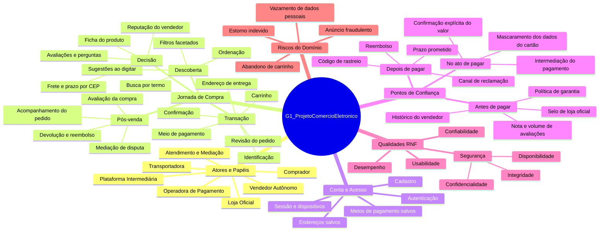

# Artefato Generalista

Conforme decidido na [reunião de 24/08/2026](/Atas/Subequipe1/ata24_08.md), cada integrante da Subequipe 01 produz o **seu próprio** artefato generalista, escolhendo entre Rich Picture e Mapa Mental, e justificando a escolha. Esta página reúne os artefatos individuais.

---

## Mapa Mental — Pedro Luciano de Azevedo

### O que é o artefato

O **Mapa Mental** é uma técnica de representação gráfica radial na qual um conceito central é progressivamente refinado em ramos hierárquicos, com uso deliberado de palavras-chave curtas, cor e posição espacial para apoiar a memória e a associação de ideias (BUZAN; BUZAN, 1993). Diferentemente de um diagrama de fluxo, o mapa mental **não representa ordem temporal nem decisão**: ele representa _composição_ — o que existe no domínio e como cada elemento se subordina a um agrupamento maior.

Na engenharia de software, esse tipo de representação se enquadra no que a literatura chama de artefato de **elicitação e organização de escopo**: um modelo informal, de baixo custo de produção e alta densidade de comunicação, cuja função é dar à equipe uma visão compartilhada do território antes de qualquer modelagem formal.

### O artefato

_Clique no diagrama para abri-lo em tamanho real._

> _Figura 1 — Mapa Mental do G1_ProjetoComercioEletronico, elaborado a partir do comércio eletrônico tomado como fonte de inspiração para o projeto ([Projeto](/Projeto/Projeto.md)). Nó central: o sistema em estudo. Ramos de 1º nível: domínios funcionais (Descoberta do Produto, Decisão de Compra, Transação & Pagamento, Pós-venda), o contexto de atores, o subsistema de conta e acesso, e o ramo de qualidades (RNFs). Folhas: elementos efetivamente observados na interface durante a engenharia reversa._

### Por que escolhi Mapa Mental (e não Rich Picture)

A escolha não foi por preferência estética, mas pelo **papel que o artefato precisava cumprir dentro desta entrega**. Três razões:

**1. O artefato precisava cobrir o sistema inteiro, não uma situação.**
O Rich Picture, na tradição da _Soft Systems Methodology_ de Checkland (CHECKLAND, 1981; MONK; HOWARD, 1998), é forte exatamente onde o problema é _mal estruturado_: ele captura atores, preocupações, conflitos e o contexto de trabalho ao redor de uma situação. Seu poder está em mostrar tensão e ponto de vista. Só que o que a Subequipe 01 precisava neste momento era o oposto: um **inventário estruturado e navegável de todo o domínio**, para depois recortar dele o requisito não funcional do SIG e o fluxo do BPMN. Para inventariar composição, a hierarquia do mapa mental é mais direta do que a cena do Rich Picture.

**2. Precisava de rastreabilidade explícita para os outros dois artefatos.**
O ramo _Qualidades (RNFs)_ do mapa aponta diretamente para o SIG de Usabilidade planejado, e o ramo _Descoberta do Produto_ enumera exatamente os elementos (busca, autocompletar, filtros facetados, ordenação, breadcrumb) que devem reaparecer como **operacionalizações** no SIG e como **atividades** no BPMN quando esses artefatos forem construidos. A estrutura em ramos permite marcar esses elos ponto a ponto; em um Rich Picture, essa correspondência ficaria diluída na composição pictórica.

**3. Complementaridade dentro do grupo G1.**
A Subequipe 03 já produziu um Rich Picture da perspectiva do comprador. Fazer outro Rich Picture geraria redundância entre subequipes. Adotando o Mapa Mental, o grupo passa a ter as duas leituras — a situacional (Subequipe 03) e a composicional (esta) — sobre o mesmo domínio, o que é mais informativo do que duas versões da mesma técnica.

### Senso crítico sobre o artefato

O mapa mental tem limitações que reconheço e que motivaram os artefatos seguintes:

- **Não expressa ordem nem condição.** O mapa diz que "Filtros facetados" e "Ordenação" existem, mas não diz que o comprador só ordena _depois_ de filtrar, nem o que acontece quando a busca não retorna resultados. Essa lacuna é precisamente o que o BPMN preenche.
- **Não expressa conflito.** No mapa, "Usabilidade" e "Desempenho" são dois nós irmãos, aparentemente independentes. Na prática, filtros facetados com contadores ajudam a usabilidade e **prejudicam** o tempo de resposta. Representar esse trade-off exige a notação do NFR Framework — e é por isso que o ramo de qualidades é um _ponteiro_, não uma resposta.
- **A hierarquia impõe uma classificação que nem sempre é única.** "Frete e prazo por CEP" foi colocado sob _Decisão de Compra_, mas poderia estar sob _Transação_. Escolhi manter sob Decisão porque, na interface observada, o frete é exibido **antes** do carrinho, e é essa antecipação que sustenta o softgoal _Prevenção de Erros_ no SIG. A classificação, portanto, carrega uma decisão de projeto — o que é uma virtude do artefato, desde que documentada.

> **Nota de escopo:** o ramo _Qualidades (RNFs)_ e o ramo _Descoberta do Produto_ deste mapa são o ponto de partida planejado para o SIG de Usabilidade e para a modelagem BPMN, respectivamente — ambos ainda em elaboração. A tabela de elos ponto a ponto entre os três artefatos será adicionada aqui quando os três estiverem publicados.

---

## Rich Picture — Guilherme Costa Zanella

### O que é o artefato

O **Rich Picture** é um artefato informal, desenhado à mão, originado na _Soft Systems Methodology_ de Checkland (1981) e sistematizado como ferramenta de projeto por Monk e Howard (1998). Sua função é reunir em uma única folha os dados sobre uma situação complexa e mal estruturada, retratando os principais _stakeholders_, suas inter-relações e suas **preocupações** (_concerns_).

Para Monk e Howard, _concerns_ são os objetivos de alto nível que restringem significativamente o modo como o trabalho é feito — e sistemas efetivos só podem ser projetados considerando os _concerns_ divergentes dos envolvidos.

### O artefato

_Clique na imagem para abri-la em tamanho real._

> _Figura 2 — Rich Picture do fluxo de compra da Jenny no G1_ProjetoComercioEletronico. Contorno laranja: vendedores. Contorno azul: fronteira do sistema. Nuvens: preocupações. Espadas cruzadas: tensão. Fonte: Autor, 2026._

O nome fictício **Jenny** referencia o exemplo conduzido por Monk e Howard na Figura 3 do artigo. A compradora foi posicionada ao centro seguindo a orientação dos autores: começar o desenho pela figura do usuário principal evita a tendência de assumir uma visão orientada ao sistema.

### Por que Rich Picture (e não Mapa Mental)

O Mapa Mental produzido nesta subequipe entrega um inventário do domínio e reconhece, em seu próprio senso crítico, que **não expressa conflito**. O Rich Picture ataca essa lacuna: ele registra pontos de vista divergentes e tensões.

### Leitura pelo modelo de Monk e Howard

Os autores Monk e Howard estabelecem que os três componentes mais importantes de um Rich Picture são **estrutura, processo e _concerns_**.

#### Estrutura

Aspectos que mudam lentamente, incluindo todas as pessoas que usarão ou poderão ser afetadas pelo sistema.

Registrados: Jenny (compradora), loja oficial, vendedor autônomo, atendimento, transportadora, operadora de pagamento, catálogo de produtos, e as duas fronteiras (vendedores e plataforma).

#### Processo

As transformações que ocorrem no processo do trabalho. Três fluxos foram registrados:

1. **Compra** — vendedores anunciam, plataforma expõe, Jenny paga, plataforma retém comissão e repassa ao vendedor
2. **Produto** — do vendedor à transportadora, e da transportadora até Jenny
3. **Reclamação** — Jenny reclama, atendimento media com o vendedor, e retorna com resposta ou reembolso

#### Preocupações/Concerns

Capturam as motivações particulares de um usuário ao usar o sistema, caricaturado em balões de pensamento:

| Stakeholder       | Preocupações/Concerns                             |
| ----------------- | ------------------------------------------------- |
| Jenny             | "o produto é confiável? quando chega?"            |
| Loja oficial      | "eu pago mais, então apareço mais"                |
| Vendedor autônomo | "por que meu anúncio nunca aparece na 1ª página?" |
| Atendimento       | "quem tem razão?"                                 |

#### Tensões

A tensão registrada opõe **loja oficial e vendedor autônomo**, que competem pela mesma vitrine sob regras que favorecem quem investe em anúncio.

### Senso crítico

- **A subequipe não aparece no desenho.** Monk e Howard recomendam incluir os analistas na estrutura, para lembrar que também têm ponto de vista e possível viés. Lacuna reconhecida.
- **Apenas uma tensão foi grafada.** Outras tensões poderiam ter sido registradas como por exemplo atendimento x vendedor x jenny (cliente) e operadora de pagamento (comissão) x vendedor (lucro)
- **O artefato não expressa ordem nem condição.** O fluxo de reclamação mostra que há mediação e dois desfechos possíveis, mas não sob quais condições. Limitação intrínseca do rich Picture isso pode ser melhor explorado no BPMN
- **O desenho revelou algo não previsto.** Jenny não tem ligação direta com os vendedores: produto, dinheiro, informação e reclamação passam todos pela plataforma. Essa centralidade emergiu ao ligar os fluxos.

---

## Mapa Mental — Patrick Anderson Carvalho dos Santos

### O que é o artefato

O **Mapa Mental** é uma representação gráfica radial: parte-se de um conceito central e refina-se o assunto em ramos hierárquicos, usando palavras-chave curtas, cor e posição espacial como apoio à memória e à associação (BUZAN; BUZAN, 1993). Eppler (2006), ao comparar mapas mentais, mapas conceituais, diagramas conceituais e metáforas visuais, delimita com precisão o que cada um entrega: o mapa mental é **multi-hierárquico e centrado em um único tópico**, ótimo para *elicitar* e *organizar* rapidamente o que uma pessoa sabe sobre um domínio, e fraco em representar relações nomeadas entre ramos distintos — para isso serve o mapa conceitual, com arestas rotuladas (NOVAK; CAÑAS, 2008).

Essa delimitação importa aqui porque define o que este artefato **pode** e o que ele **não pode** afirmar. Ele afirma composição e subordinação; ele não afirma sequência, condição, causa nem conflito.

### O artefato

> _Figura 3 — Mapa Mental do G1_ProjetoComercioEletronico sob a ótica de **confiança transacional**. Nó central: o sistema em estudo. Ramos de 1º nível: atores, jornada, subsistema de conta, pontos de confiança, qualidades e riscos. Diagrama escrito em Mermaid e versionado como código-fonte neste próprio arquivo. Fonte: Autor, 2026._

### Por que escolhi Mapa Mental (e não Rich Picture)

**1. O papel que sobrou para mim na subequipe era o de recorte, não o de cena.**
A Subequipe 01 já tinha, quando comecei, um Mapa Mental composicional (Pedro Luciano) e um Rich Picture situacional (Guilherme Zanella). Produzir um terceiro Rich Picture seria repetir a leitura que o Guilherme já entregou. O que faltava não era outra técnica: era **outra pergunta** feita ao mesmo domínio. A minha pergunta é "em que momentos o comprador precisa confiar, e no que exatamente ele confia?" — e essa pergunta produz uma hierarquia, não uma cena. Eppler (2006) é explícito ao dizer que a escolha entre esses formatos deve seguir a tarefa cognitiva, não o gosto.

**2. O artefato precisava sustentar dois artefatos posteriores meus, não um.**
O ramo *Transação* enumera exatamente os estados que eu inventariei na [Engenharia Reversa](/Base/Relatórios/SubEquipe01/EngenhariaReversa.md) do fluxo de checkout, e o ramo *Qualidades RNF → Segurança* nomeia o softgoal raiz e a decomposição de primeiro nível do meu [SIG de Segurança](/Base/Relatórios/SubEquipe01/NFR.md). O ramo *Pontos de Confiança* é a ponte entre os dois: cada folha dele reaparece como **operacionalização** no SIG. A rastreabilidade ponto a ponto está tabelada na seção seguinte.

**3. O artefato precisava ser código, não imagem.**
Esta é a razão que me fez escolher **Mermaid** e não uma ferramenta de desenho. Um `.png` exportado de ferramenta gráfica é opaco ao versionamento: o `git diff` mostra que o binário mudou, não *o que* mudou. Escrito em Mermaid, o mapa é texto — cada nó novo aparece como uma linha adicionada no *diff* do commit, e a revisão em *pull request* discute o conteúdo do modelo, não a captura de tela dele. Isso responde diretamente a uma exigência das Diretrizes: "MOSTRAR QUADRO DE PARTICIPAÇÕES & COMMITS". Um artefato-como-código **é** o comprobatório, e não depende de um quadro à parte afirmando quem o fez.

Como efeito colateral, foi preciso habilitar o Mermaid no GitPages do grupo — o `docs/index.html` rodava Docsify sem o renderizador. A alteração está registrada em [Iniciativas Extras](/Base/1.3.IniciativasExtras.md) e beneficia as três subequipes.

### Rastreabilidade e elos com outros artefatos

| Ramo / folha do Mapa Mental | Artefato de destino | Como reaparece lá |
| -- | -- | -- |
| `Jornada → Transação` (6 folhas) | Engenharia Reversa — fluxo de checkout | Cada folha vira um **estado de tela** inventariado |
| `Jornada → Transação → Meio de pagamento` | Engenharia Reversa | Origem das regras RN-P01 a RN-P04 (máscaras, validação e obrigatoriedade) |
| `Qualidades RNF → Segurança` | SIG (NFR Framework) | **Softgoal raiz** do meu galho |
| `Segurança → Integridade / Confidencialidade / Disponibilidade` | SIG | Decomposição AND de 1º nível do softgoal raiz |
| `Pontos de Confiança → No ato de pagar` | SIG | **Operacionalizações** do galho de Confidencialidade |
| `Pontos de Confiança → Antes de pagar` | Rich Picture (Guilherme) | Mesmos *concerns* de Jenny, aqui como composição em vez de balão de pensamento |
| `Riscos do Domínio` | SIG | Justificam os *claims* que sustentam as decisões do grafo |
| `Jornada → Transação` | BPMN | Sequência de atividades da *pool* do comprador |

### Senso crítico sobre o artefato

- **A hierarquia esconde que "Pontos de Confiança" não é um ramo — é uma leitura transversal.** Selo de loja oficial, mascaramento de cartão e código de rastreio pertencem, respectivamente, a Decisão, Transação e Pós-venda. Eu os agrupei em um ramo próprio porque é isso que a minha pergunta faz emergir, mas o preço é real: o mesmo elemento aparece implicitamente em dois lugares. Um mapa **conceitual**, com arestas rotuladas do tipo "mitiga" ligando `Anúncio fraudulento` a `Histórico do vendedor`, representaria isso sem duplicar (NOVAK; CAÑAS, 2008). Escolhi manter a duplicação porque o artefato pedido no escopo desta entrega é mapa mental, e porque a relação "mitiga" é exatamente o que o SIG vai formalizar como contribuição.
- **O mapa não diz o que custa.** `Segurança` e `Usabilidade` estão lado a lado como ramos irmãos, o que sugere independência. É falso: exigir reautenticação no pagamento melhora Integridade e piora Facilidade de Uso. O mapa mental não tem notação para esse trade-off — só o NFR Framework tem, via contribuições negativas e propagação de rótulos (CHUNG et al., 2000). O ramo de qualidades é, portanto, um **ponteiro** para o SIG, não uma resposta.
- **O mapa não diz o que é observado e o que é inferido.** `Intermediação do pagamento` foi colocado no mapa a partir do que a interface exibe ao comprador; a existência real de uma custódia de valores é hipótese, não observação. O artefato não distingue os dois status. Quem faz essa distinção é a Engenharia Reversa, onde marquei explicitamente cada achado inferido.
- **Mermaid restringe o desenho.** O renderizador de `mindmap` não permite controlar posição, cor por ramo nem ícones com liberdade, e trunca rótulos longos. Perdi expressividade visual em troca de rastreabilidade em commit. Considero a troca vantajosa nesta entrega — cuja avaliação exige comprobatórios de autoria — mas reconheço que, para um artefato cujo objetivo fosse comunicar a um público não técnico, um desenho livre comunicaria melhor.

---

## Referências

BUZAN, Tony; BUZAN, Barry. **The Mind Map Book**. London: BBC Books, 1993.

CHECKLAND, Peter. **Systems Thinking, Systems Practice**. Chichester: John Wiley & Sons, 1981.

CHUNG, Lawrence; NIXON, Brian A.; YU, Eric; MYLOPOULOS, John. **Non-Functional Requirements in Software Engineering**. Boston: Kluwer Academic Publishers, 2000.

EPPLER, Martin J. A comparison between concept maps, mind maps, conceptual diagrams, and visual metaphors as complementary tools for knowledge construction and sharing. **Information Visualization**, v. 5, n. 3, p. 202–210, 2006.

NOVAK, Joseph D.; CAÑAS, Alberto J. **The Theory Underlying Concept Maps and How to Construct and Use Them**. Technical Report IHMC CmapTools 2006-01 Rev 01-2008. Pensacola: Florida Institute for Human and Machine Cognition, 2008.

MONK, Andrew; HOWARD, Steve. The Rich Picture: A Tool for Reasoning About Work Context. **Interactions**, v. 5, n. 2, p. 21–30, mar./abr. 1998.

---

## Histórico de Versões

| Versão | Data       | Descrição                                           | Autor(es)                  | Revisor(es)          |
| ------ | ---------- | --------------------------------------------------- | -------------------------- | -------------------- |
| 1.0    | 24/08/2026 | Estruturação inicial                                | José Joaquim da Silva Neto | Pedro Henrique Gomes |
| 1.1    | 26/08/2026 | Adição do Mapa Mental e da justificativa da escolha | Pedro Luciano de Azevedo   | --                   |
| 1.2    | 26/08/2026 | Adição do Rich Picture e dos textos explicativos    | Guilherme Costa Zanella    | --                   |
| 1.3    | 27/08/2026 | Adição do Mapa Mental em Mermaid sob a ótica de confiança transacional, com justificativa da escolha, tabela de rastreabilidade e senso crítico | Patrick Anderson Carvalho dos Santos | -- |
