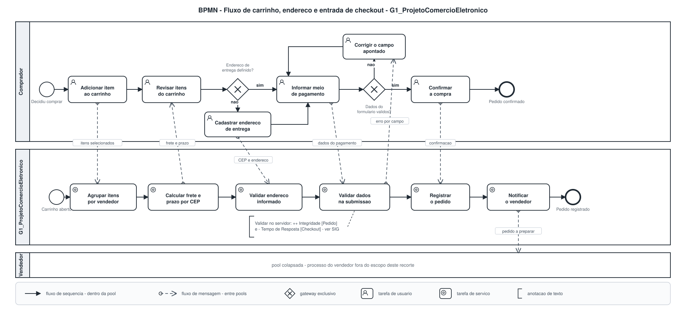
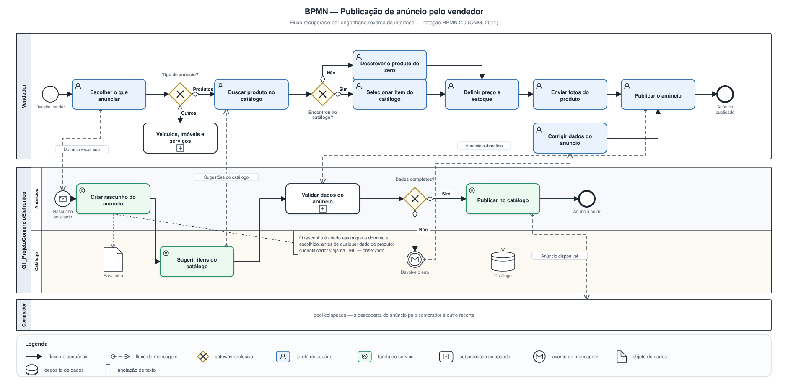

# Modelagem BPMN

Conforme decidido na [reunião de 24/08/2026](/Atas/Subequipe1/ata24_08.md), o modelo BPMN parte dos fluxos identificados pela [Engenharia Reversa](/Base/Relatórios/SubEquipe01/EngenhariaReversa.md), e cada integrante ficou responsável por uma parte. Esta página reúne os modelos da Subequipe 01.

---

## Checkout e publicação de anúncio — Patrick Anderson Carvalho dos Santos

### O que é a notação

BPMN é o padrão da OMG para modelagem de processos de negócio (OMG, 2011). A escolha não é neutra para este trabalho: entre os diagramas disponíveis, o BPMN é o único que separa **quem faz** — *pools* e raias — do **que é trocado entre os participantes** — o fluxo de mensagem. Essa separação é exatamente o que uma engenharia reversa de caixa-preta precisa expressar, porque tudo que se observa é troca, e o que acontece dentro da plataforma é inferência.

Três regras da notação são estruturais e foram seguidas com atenção:

1. **Fluxo de sequência não atravessa pool.** Comunicação entre participantes é sempre fluxo de mensagem — linha tracejada, círculo vazado na origem, ponta de seta aberta no destino.
2. **Gateway não decide nada por conta própria.** O losango marca a bifurcação; a condição fica no rótulo do fluxo de saída.
3. **Cada pool com fluxo de sequência tem início e fim próprios.** As raias abertas dos dois modelos têm o seu evento de início e o seu evento de fim.

Os dois diagramas são gerados por [`bpmn_patrick.py`](https://github.com/UnBArqDsw2026-2-Turma01/2026.2-T01-_G1_ProjetoComercioEletronico_Entrega_01/blob/main/docs/assets/SubEquipe01/src/bpmn_patrick.py):

```bash
python3 docs/assets/SubEquipe01/src/bpmn_patrick.py
```

---

### Modelo 1 — Carrinho, endereço e checkout

[](../../../assets/SubEquipe01/BPMN_Checkout_Patrick.svg ":ignore")

<sub>Clique na imagem para abrir o visualizador em tela cheia, com zoom e arraste.</sub>

> _Figura 6 — Fluxo de carrinho, endereço de entrega e checkout, com o comprador em uma pool e a plataforma em outra, dividida em três raias. Fonte: Autor, 2026._

O laço de correção depois do gateway `Dados do formulário válidos?` é a parte mais informativa do desenho, e ele existe por causa de um defeito. Em um sistema que validasse campo a campo na perda de foco, o laço seria curto e local. Como a validação só acontece na submissão (RN-B06), o comprador preenche o formulário inteiro, envia, e só então descobre o erro — o que no modelo aparece como um retorno que atravessa o gateway.

### Modelo 2 — Publicação de anúncio pelo vendedor

[](../../../assets/SubEquipe01/BPMN_PublicacaoAnuncio_Patrick.svg ":ignore")

<sub>Clique na imagem para abrir o visualizador em tela cheia, com zoom e arraste.</sub>

> _Figura 7 — Fluxo de publicação de anúncio, do lado do vendedor. A pool do comprador aparece colapsada porque a descoberta do anúncio é outro recorte. Fonte: Autor, 2026._

O detalhe que este modelo torna visível é a ordem: a tarefa de serviço `Criar rascunho do anúncio` acontece **antes** de qualquer dado do produto ser informado, disparada apenas pela escolha do domínio (RN-C01). Foi um achado da observação da URL, não do percurso — o identificador do rascunho aparece no endereço logo depois do primeiro clique.

---

### Recursos da notação utilizados

As Diretrizes pedem para usar os vários recursos de modelagem da notação. Os dois modelos empregam:

| Recurso | Onde aparece | Por que estava lá |
| -- | -- | -- |
| *Pool* aberta | `Comprador`, `Vendedor`, `G1_ProjetoComercioEletronico` | Participantes com processo próprio observável |
| *Pool* colapsada | `Vendedor` no modelo 1, `Comprador` no modelo 2 | Participam do processo, mas seu interior está fora do recorte |
| Raias | Catálogo e Carrinho, Entrega, Pagamentos, Anúncios | Separam responsabilidades dentro da plataforma |
| Evento de início simples e de mensagem | Um par por pool aberta | O da plataforma é de mensagem porque é o comprador quem dispara |
| Evento de fim simples, de erro e de terminação | Fim dos dois modelos | Erro: pagamento recusado. Terminação: checkout expirado |
| Evento de borda (temporizador e erro) | Sobre `Informar meio de pagamento` e `Autorizar pagamento` | Interrompem a atividade em curso |
| Evento intermediário de mensagem | `Devolve o erro`, no modelo 2 | Dispara a mensagem de erro ao vendedor |
| Tarefa de usuário e de serviço | Raias do comprador/vendedor e da plataforma | Distinguem o que é feito por pessoa do que é automatizado |
| Subprocesso colapsado | `Validar dados do formulário`, `Validar dados do anúncio` | Atividade composta cujo interior não foi observado |
| Gateway exclusivo e paralelo | Bifurcações e o par registrar/notificar | Só as bifurcações que a observação sustenta |
| Fluxo de mensagem | 12 ligações entre pools nos dois modelos | Cada troca observada |
| Objeto e depósito de dados | `Pedido`, `Rascunho`, `Catálogo` | Dados que o processo lê ou produz |
| Anotação de texto | Sobre `Validar dados do formulário` e `Criar rascunho do anúncio` | Ligam o modelo ao SIG e marcam o que é inferido |

### Rastreabilidade

| Elemento | Origem |
| -- | -- |
| `Adicionar item ao carrinho` → `Agrupar itens por vendedor` | T-B01, T-B02 e RN-B01 |
| `Calcular frete e prazo por CEP` → `Revisar itens do carrinho` | RN-A04 — o frete é conhecido antes do checkout |
| `Cadastrar endereço de entrega` e o gateway que leva a ele | T-B03 e T-B04 |
| Gateway `Dados do formulário válidos?` e o laço de correção | RN-B06 e T-B05 |
| Anotação sobre `Validar dados do formulário` | Correlação `−` do [SIG](/Base/Relatórios/SubEquipe01/NFR.md) sobre `Tempo de Resposta` |
| `Criar rascunho do anúncio` e sua anotação | RN-C01 e RN-C02 |
| Gateway `Encontrou no catálogo?` | RN-C04 e RN-C06 |
| `Publicar no catálogo` e o depósito `Catálogo` | RN-C04 e RN-B09 — o vínculo com o catálogo explica as ofertas concorrentes na ficha |
| `Confirmar a compra`, `Registrar o pedido`, `Autorizar pagamento` | Inferidos — o percurso parou antes do pagamento |

### Limites dos modelos

- **A raia da plataforma é hipótese, e o diagrama não sinaliza isso graficamente.** Todas as tarefas de serviço foram derivadas do comportamento observável. A notação não tem recurso próprio para marcar "atividade inferida", e preferi registrar a distinção no texto a inventar uma convenção gráfica que ninguém mais leria.
- **Modelei o caminho feliz com poucas exceções.** Ficaram de fora: item que sai de estoque enquanto está no carrinho, CEP fora de área de entrega, anúncio recusado por política. Nenhum foi observado, e adicioná-los por dedução encheria o desenho de caminhos que não posso sustentar.
- **O evento temporizador sobre o pagamento é inferido.** Está no modelo porque expiração de sessão de checkout é comportamento padrão do domínio, mas eu não a observei. A anotação ao lado diz isso.
- **Modelar depois do SIG mudou o desenho.** A anotação sobre `Validar dados do formulário` só existe porque o SIG já tinha registrado que validar no servidor cobra em tempo de resposta. Se o BPMN viesse primeiro, seria só uma sequência de caixas.

---

## Referências

OBJECT MANAGEMENT GROUP. **Business Process Model and Notation (BPMN), Version 2.0**. OMG Document formal/2011-01-03. Needham: OMG, 2011.

CHIKOFSKY, Elliot J.; CROSS II, James H. Reverse engineering and design recovery: a taxonomy. **IEEE Software**, v. 7, n. 1, p. 13–17, jan. 1990.

CHUNG, Lawrence; NIXON, Brian A.; YU, Eric; MYLOPOULOS, John. **Non-Functional Requirements in Software Engineering**. Boston: Kluwer Academic Publishers, 2000.

---

## Histórico de Versões

| Versão | Data | Descrição | Autor(es) | Revisor(es) |
| -- | -- | -- | -- | -- |
| 1.0 | 24/08/2026 | Estruturação inicial | José Joaquim da Silva Neto | Pedro Henrique Gomes |
| 1.1 | 27/08/2026 | Adição dos modelos de checkout e de publicação de anúncio, com tabela de recursos da notação e rastreabilidade | Patrick Anderson Carvalho dos Santos | -- |
