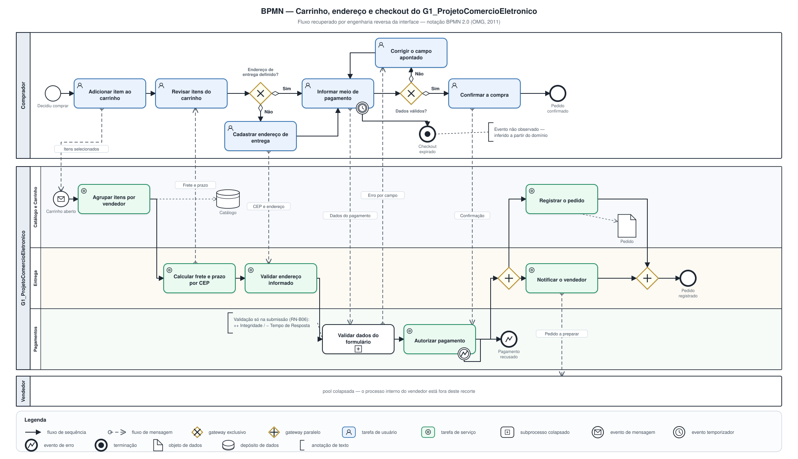

# Modelagem BPMN
 
Conforme decidido na [reunião de 24/08/2026](/Atas/Subequipe1/ata24_08.md), o modelo BPMN parte dos fluxos identificados pela [Engenharia Reversa](/Base/Relatórios/SubEquipe01/EngenhariaReversa.md), e cada integrante ficou responsável por uma parte. Esta página reúne os modelos da Subequipe 01.
 
---
 
## Checkout e publicação de anúncio
 
### O que é a notação
 
BPMN é o padrão da OMG para modelagem de processos de negócio (OMG, 2011). A escolha não é neutra para este trabalho: entre os diagramas disponíveis, o BPMN é o único que separa **quem faz** — *pools* e raias — do **que é trocado entre os participantes** — o fluxo de mensagem. Essa separação é exatamente o que uma engenharia reversa de caixa-preta precisa expressar, porque tudo que se observa é troca, e o que acontece dentro da plataforma é inferência.
 
Três regras da notação são estruturais e foram seguidas com atenção:
 
1. **Fluxo de sequência não atravessa pool.** Comunicação entre participantes é sempre fluxo de mensagem — linha tracejada, círculo vazado na origem, ponta de seta aberta no destino.
2. **Gateway não decide nada por conta própria.** O losango marca a bifurcação; a condição fica no rótulo do fluxo de saída.
3. **Cada pool com fluxo de sequência tem início e fim próprios.** As raias abertas dos dois modelos têm o seu evento de início e o seu evento de fim.
 
Os dois diagramas são gerados por [`bpmn_patrick.py`](https://github.com/UnBArqDsw2026-2-Turma01/2026.2-T01-_G1_ProjetoComercioEletronico_Entrega_01/blob/main/docs/assets/SubEquipe01/src/bpmn_patrick.py):
 
```bash
python3 docs/assets/SubEquipe01/src/bpmn_patrick.py
```
 
---
 
### Modelo 1 — Carrinho, endereço e checkout
 
[](../../../assets/SubEquipe01/BPMN_Checkout.svg ":ignore")
 
<sub>Clique na imagem para abrir o visualizador em tela cheia, com zoom e arraste.</sub>
 
> _Figura 6 — Fluxo de carrinho, endereço de entrega e checkout, com o comprador em uma pool e a plataforma em outra, dividida em três raias. Fonte: Autor, 2026._
 
O laço de correção depois do gateway `Dados do formulário válidos?` é a parte mais informativa do desenho, e ele existe por causa de um defeito. Em um sistema que validasse campo a campo na perda de foco, o laço seria curto e local. Como a validação só acontece na submissão (RN-B06), o comprador preenche o formulário inteiro, envia, e só então descobre o erro — o que no modelo aparece como um retorno que atravessa o gateway.

## Histórico de Versões

| Versão | Data | Descrição | Autor(es) | Revisor(es) |
| -- | -- | -- | -- | -- |
| 1.0 | 27/08/2026 | Inclusão do modelo BPMN de carrinho, endereço de entrega e checkout | Patrick Anderson | -- |
