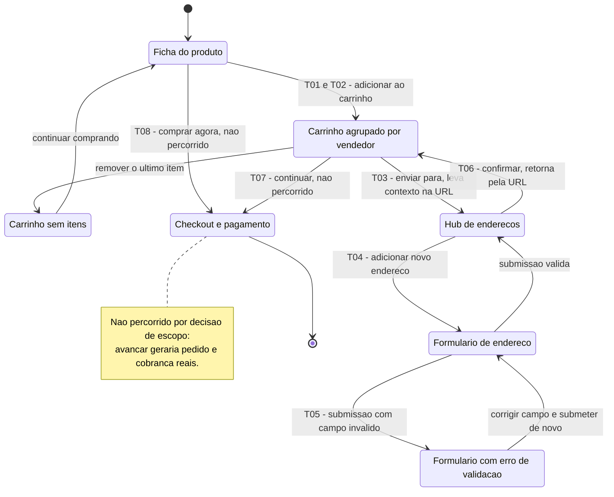

# Engenharia Reversa

Conforme decidido na [reunião de 24/08/2026](/Atas/Subequipe1/ata24_08.md), a engenharia reversa é feita registrando **por escrito** cada elemento observado na tela, para então derivar fluxos, regras de negócio e requisitos — as perguntas do material da professora foram divididas entre os integrantes. Esta página reúne os registros individuais da Subequipe 01.

---

## Fluxo de Busca e Escolha de Produto — Pedro Luciano de Azevedo

> **Nota de escopo:** este recorte é a base para o SIG de Usabilidade e para a [Modelagem BPMN](/Base/Relatórios/SubEquipe01/BPMN.md) do mesmo fluxo, ambos ainda em elaboração.

### 1. Contexto da engenharia reversa

**Objeto de estudo.** O G1_ProjetoComercioEletronico tem como fonte de inspiração um comércio eletrônico de grande porte com modelo misto B2C/C2C — múltiplos vendedores independentes anunciando sob o mesmo catálogo. Conforme as Diretrizes da disciplina, a fonte de inspiração não é nomeada neste relatório.

**Recorte.** Fluxo de **busca e escolha de produto**: do momento em que o comprador digita um termo até o momento em que decide que aquele produto é o que ele quer. Escolhi este recorte por três razões: (i) é integralmente observável sem conta autenticada e sem realizar compra; (ii) é o fluxo com maior densidade de decisões de usabilidade, o que o conecta diretamente ao SIG de Usabilidade planejado; e (iii) é o fluxo em que o comprador desiste, quando desiste.

### 2. Processo aplicado

O que foi feito se enquadra no que Chikofsky e Cross (1990) definem como **engenharia reversa**: o processo de analisar um sistema para identificar seus componentes e inter-relações, e criar representações do sistema em outra forma ou em nível mais alto de abstração — sem alterá-lo. Trata-se, mais especificamente, de **recuperação de projeto** (*design recovery*), em que se combina a observação do artefato com conhecimento de domínio para reconstruir abstrações que o artefato não expõe.

Como não há acesso ao código-fonte, o método é de **caixa-preta, a partir da interface** — abordagem análoga à do *GUI ripping* descrito por Memon, Banerjee e Nagarajan (2003), em que a estrutura do sistema é inferida percorrendo sistematicamente os estados da interface e registrando os widgets, eventos e transições de cada estado.

**Etapas executadas:**

| # | Etapa | O que foi feito |
| -- | -- | -- |
| 1 | Delimitação | Definição do recorte (busca → escolha) e do ator principal (comprador não autenticado) |
| 2 | Percurso exploratório | Execução do fluxo do início ao fim, sem registro, para reconhecer os estados de tela |
| 3 | Inventário de tela | Segundo percurso, registrando **por escrito** cada elemento visível por estado: campos, controles, dados exibidos, feedbacks |
| 4 | Provocação de exceções | Busca com termo sem resultado, filtro que zera a listagem, uso do botão "voltar" do navegador |
| 5 | Inferência de fluxo | Derivação da sequência de atividades, pontos de decisão e trocas de mensagem entre comprador e plataforma |
| 6 | Inferência de regras e requisitos | Extração de regras de negócio e requisitos a partir do que o inventário e as exceções evidenciam |

**Ferramentas.** Navegador (inspeção visual e observação da URL) e planilha compartilhada do grupo para o inventário escrito.

### 3. Achados — inventário do que está na tela

| Estado de tela | Elementos observados |
| -- | -- |
| **Vitrine / campo de busca** | Campo de busca com foco automático; lista de sugestões que surge **ao digitar**, antes de submeter; histórico de buscas recentes |
| **Listagem de resultados** | Contador de resultados; facetas de filtro (categoria, preço, condição, frete, localização) **com contador por opção**; seletor de ordenação (relevância, menor preço, maior preço); breadcrumb de categorias; cartões de produto; carregamento de novos resultados **por rolagem**, sem paginação clicável; filtros e página refletidos como **parâmetros na URL** |
| **Cartão de produto (na listagem)** | Imagem; título; preço e parcelamento; selo de frete; **nota, número de avaliações** e indicação de reputação do vendedor |
| **Ficha do produto** | Carrossel de imagens com zoom; preço e parcelamento; **campo de CEP que recalcula frete e prazo na própria página**; dados do vendedor com reputação; bloco de avaliações; perguntas e respostas; produtos relacionados |
| **Estado vazio** | Mensagem de "nenhum resultado"; sugestão de termos alternativos; sugestão de remover filtros |
| **Retorno pelo botão "voltar"** | Os filtros são preservados (vêm da URL); a **posição de rolagem não é** — a listagem reinicia do topo |

### 4. Achados — regras de negócio inferidas

| ID | Regra de negócio |
| -- | -- |
| RN01 | A listagem só é exibida se a consulta retornar ao menos um resultado; caso contrário, o sistema apresenta estado vazio com termos alternativos. |
| RN02 | A ordenação padrão da listagem é por relevância, não por preço. |
| RN03 | Filtros são cumulativos e cada faceta exibe antecipadamente a quantidade de resultados que restará ao ser aplicada. |
| RN04 | O frete e o prazo dependem do CEP informado e são calculados na ficha do produto, **antes** do carrinho. |
| RN05 | Todo produto de marketplace exibe reputação do vendedor junto ao preço, já na listagem. |
| RN06 | O estado da consulta (termo, filtros, ordenação, página) é carregado na URL, o que torna a busca compartilhável e reproduzível. |

### 5. Achados — requisitos derivados

| ID | Requisito | Tipo |
| -- | -- | -- |
| RF01 | O sistema deve sugerir termos enquanto o comprador digita, antes da submissão. | Funcional |
| RF02 | O sistema deve permitir filtrar a listagem por facetas cumulativas, exibindo a contagem prévia de resultados. | Funcional |
| RF03 | O sistema deve permitir reordenar a listagem por relevância e por preço. | Funcional |
| RF04 | O sistema deve calcular frete e prazo por CEP na ficha do produto. | Funcional |
| RF05 | O sistema deve apresentar, para cada oferta, nota, número de avaliações e reputação do vendedor. | Funcional |
| RF06 | Em consulta sem resultados, o sistema deve oferecer termos alternativos. | Funcional |
| RNF01 | O comprador deve alcançar a ficha do produto em poucos passos a partir da busca. | Não funcional — Eficiência de Uso |
| RNF02 | O retorno à listagem deve preservar filtros **e posição**. | Não funcional — Reversibilidade |
| RNF03 | A aplicação de uma faceta deve produzir feedback imediato na listagem. | Não funcional — Feedback Imediato |

> **RNF02 é um requisito que o sistema observado não satisfaz.** Ele foi derivado justamente da etapa de provocação de exceções (etapa 4): o retorno pelo botão "voltar" preserva os filtros (carregados na URL), mas reinicia a posição de rolagem da listagem. Esse achado é o ponto de partida para o SIG de Usabilidade e para a modelagem BPMN deste fluxo, ainda não adicionados.

### 6. Senso crítico

- **Os achados são uma hipótese sobre o interior, não uma descrição dele.** As atividades internas inferidas (como "consultar índice do catálogo" e "ranquear e paginar resultados") foram derivadas do comportamento observável, não observadas diretamente. Elas são plausíveis e suficientes para explicar o que se vê, mas a implementação real pode ser bastante diferente. Chikofsky e Cross (1990) são explícitos quanto a isso: recuperação de projeto produz abstrações **coerentes com** o sistema, não necessariamente **idênticas ao** projeto original.
- **O nível de detalhe do inventário foi escolhido, não dado.** Registrei o suficiente para sustentar as regras de negócio e os requisitos listados acima, e deliberadamente **não** persegui chamadas de serviço, cache ou paginação técnica, que não são observáveis pelo método usado.
- **Limitações do método de caixa-preta.** Sem conta autenticada, ficam fora do inventário a personalização por histórico, as recomendações e qualquer variação por teste A/B — que, se existirem, alteram o fluxo real de descoberta.

---

## Fluxo de Carrinho, Endereço de Entrega e Entrada de Checkout — Patrick Anderson Carvalho dos Santos

> **Nota de escopo:** este recorte começa exatamente onde o recorte do Pedro Luciano termina. Ele encerra na decisão de que "este produto é o que eu quero"; eu retomo a partir daí, no ponto em que o comprador precisa **entregar dados** ao sistema. É deste recorte que sai o meu [SIG de Segurança](/Base/Relatórios/SubEquipe01/NFR.md).

### 1. Contexto da engenharia reversa

**Objeto de estudo.** O G1_ProjetoComercioEletronico é um comércio eletrônico com modelo misto B2C/C2C: múltiplos vendedores independentes anunciam sob um mesmo catálogo, e a plataforma intermedeia pagamento e entrega. A engenharia reversa foi aplicada sobre a interface web de um sistema de referência do mesmo domínio, tomado apenas como fonte de inspiração para identificar público-alvo, funcionalidades e regras — conforme orientam as Diretrizes da disciplina, o sistema de referência não é nomeado neste relatório.

**Recorte escolhido: carrinho → endereço de entrega → entrada do checkout.** Justifico a escolha por três razões:

1. **É onde estão os validadores.** O material da professora pede explicitamente que se infiram regras de negócio "considerando validadores de campo — máscaras, obrigatoriedade ou não —, mensagens de erro, alertas/notificações". O recorte de busca e escolha, já documentado pelo Pedro, quase não tem entrada de dados: tem um campo de busca e um de CEP. É no carrinho e no cadastro de endereço que aparecem formulários com máscara, limite de caracteres e obrigatoriedade — ou seja, é onde esse item do método pode de fato ser exercido.
2. **É onde a Segurança deixa de ser abstrata.** A partir do carrinho, o comprador passa a fornecer nome completo, telefone, endereço e, adiante, meio de pagamento. É o ponto do sistema em que Confidencialidade e Integridade saem do discurso e viram decisões de interface observáveis.
3. **É um recorte que ninguém da subequipe cobriu.** Manter o registro do Pedro intacto e acoplar o meu na fronteira dele produz, somando os dois, a jornada contínua da busca até a entrada do checkout.

### 2. Processo aplicado

O que foi feito se enquadra no que Chikofsky e Cross (1990) chamam de **recuperação de projeto** (*design recovery*): combinar a observação do artefato com conhecimento de domínio para reconstruir abstrações que o artefato não expõe. Sem acesso ao código-fonte, o método é de **caixa-preta a partir da interface**, análogo ao *GUI ripping* de Memon, Banerjee e Nagarajan (2003) — percorrer sistematicamente os estados da interface registrando *widgets*, eventos e transições.

Acrescentei ao método da subequipe uma etapa que o registro anterior não tinha: **inspeção do DOM**. O material da professora recomenda as Ferramentas de Desenvolvedor do navegador justamente para isso. A diferença prática é grande — o atributo `maxlength` de um campo, o seu `inputmode` e a presença ou ausência de `required` são regras de negócio que **estão no artefato**, e que a inspeção visual sozinha não alcança.

| # | Etapa | O que foi feito |
| -- | -- | -- |
| 1 | Delimitação | Definição do recorte na fronteira do registro anterior; ator principal: comprador autenticado |
| 2 | Percurso exploratório | Ficha do produto → carrinho → hub de endereços → formulário de endereço, sem registro |
| 3 | Inventário de tela | Segundo percurso registrando, por estado, controles, rótulos, agrupamentos e feedbacks |
| 4 | **Inspeção do DOM** | Leitura dos atributos de cada campo de formulário: `type`, `maxlength`, `inputmode`, `pattern`, `required`, `aria-label` |
| 5 | Provocação de exceções | Foco e perda de foco em campo obrigatório vazio, para observar o **momento** da validação |
| 6 | Observação da URL | Registro de como o sistema carrega estado e contexto de retorno entre telas e entre subdomínios |
| 7 | Inferência | Derivação das transições, das regras de negócio e dos requisitos |

**Ferramentas.** Navegador com Ferramentas de Desenvolvedor (inspeção do DOM e da barra de endereços). Registro textual em documento compartilhado da subequipe.

**Limite deliberado de escopo.** O percurso foi interrompido **antes** da tela de pagamento. Prosseguir exigiria confirmar uma compra real em uma conta real, o que geraria um pedido e uma cobrança — efeito colateral inaceitável para um exercício de observação. Tudo que se refere ao pagamento em si está marcado como **inferido** nas tabelas abaixo e não como observado. Essa é a limitação mais séria deste registro e está retomada no senso crítico.

### 3. Achados — inventário do que está na tela

| Estado de tela | Elementos observados |
| -- | -- |
| **Ficha do produto** | Carrossel de imagens; preço, preço com cupom e parcelamento; seletor de **quantidade** exibindo o estoque restante no próprio rótulo ("1 unidade, +50 disponíveis"); dois botões de ação primária lado a lado — **"Comprar agora"** e **"Adicionar ao carrinho"**; identificação do vendedor com link para a loja oficial e botão "Seguir"; link "Mais detalhes e formas de entrega"; bloco de outras ofertas para o mesmo produto ("109 produtos novos a partir de R$…"); no cabeçalho, controle **"Enviar para \<endereço\>"** ocupando o lugar do campo de CEP |
| **Carrinho** | Itens **agrupados por vendedor**, cada grupo com o rótulo "Produtos de \<vendedor\>"; caixa de seleção "Todos os produtos" e caixas por item; variação do produto exibida no item ("Cor: …"); painel lateral **"Resumo da compra"**; selo "Frete com desconto"; botão **"Continuar"** com a contagem de itens no rótulo; ação secundária "Compartilhar carrinho" |
| **Hub de endereços** | Lista de endereços já cadastrados com seleção; botão **"Adicionar novo endereço"**; botão **"Confirmar"** |
| **Formulário de endereço** | Campos: CEP, Rua/Avenida, Número, Complemento, informação adicional, Nome completo, Telefone de contato |
| **Checkout / pagamento** | **Não observado** — percurso interrompido deliberadamente antes de gerar pedido |

### 4. Achados — transições de estado

Registro no formato padronizado pedido pelo material da professora — *o usuário faz X, e o software exibe Y*:

| # | Evento | Resposta do software | Status |
| -- | -- | -- | -- |
| T01 | O usuário clica em **"Adicionar ao carrinho"** | O software incrementa o contador do carrinho no cabeçalho e mantém o usuário na ficha do produto | Observado |
| T02 | O usuário clica no **ícone do carrinho** | O software navega para `/gz/cart` e exibe os itens agrupados por vendedor | Observado |
| T03 | O usuário clica em **"Enviar para \<endereço\>"**, a partir do carrinho | O software **navega para outra tela** — um hub de endereços — e não abre uma janela sobreposta; a URL de destino carrega dois parâmetros: o endereço de retorno e o **contexto de origem** (`context=cart`) | Observado |
| T04 | O usuário clica em **"Adicionar novo endereço"** | O software navega para o formulário de endereço, **em outro subdomínio**, levando na URL o endereço de retorno para o hub | Observado |
| T05 | O usuário dá foco e retira o foco de um campo obrigatório **vazio** | O software **não exibe mensagem alguma** — a validação não ocorre na perda de foco | Observado |
| T06 | O usuário clica em **"Confirmar"** no hub de endereços | O software retorna ao carrinho, seguindo o endereço de retorno carregado na URL | Inferido a partir de T03 |
| T07 | O usuário clica em **"Continuar"** no carrinho | O software leva à sequência de checkout | Inferido — não percorrido |
| T08 | O usuário clica em **"Comprar agora"** na ficha do produto | O software leva ao checkout **sem passar pelo carrinho** | Inferido — não percorrido |

### 5. Achados — validadores de campo (inspeção do DOM)

Atributos efetivamente lidos no formulário de endereço:

| Campo | Rótulo acessível | `maxlength` | `inputmode` | `pattern` | `required` |
| -- | -- | -- | -- | -- | -- |
| `zipCode` | CEP | **8** | `numeric` | `[0-9]*` | ausente |
| `streetName` | Rua / Avenida | 120 | — | — | ausente |
| `streetNumber` | Número | **120** | — | — | ausente |
| `apartment` | Complemento (opcional) | 20 | — | — | ausente |
| `additionalInfo` | — (área de texto) | 128 | — | — | ausente |
| `contact` | Nome completo | 120 | — | — | ausente |
| `phone` | Telefone de contato | **120** | — | — | ausente |

Quatro leituras saem desta tabela e nenhuma delas é visível a olho nu:

1. **O CEP não usa máscara.** `maxlength="8"` com `pattern="[0-9]*"` e exemplo `05410001` significam oito dígitos sem separador. Como o hífen conta para o limite, um usuário que digite o formato usual brasileiro `05410-001` tem o último dígito descartado silenciosamente pelo próprio `maxlength` — o campo não avisa, apenas para de aceitar. É inferência a partir do atributo, não observação de digitação, e está marcada como tal.
2. **A obrigatoriedade não está declarada no HTML.** Nenhum campo traz `required`. A obrigatoriedade existe — é comunicada apenas em linguagem natural, e por negação: o único campo marcado é o **opcional**, no rótulo "Complemento (opcional)". Consequência prática: a validação é inteiramente delegada a script, e a informação de obrigatoriedade não chega por via programática a leitores de tela.
3. **O tratamento de campos numéricos é inconsistente.** O CEP recebe `inputmode="numeric"`; Número e Telefone, que também são numéricos, não recebem. Em dispositivo móvel isso significa teclado numérico em um campo e teclado alfabético nos outros dois.
4. **Os limites de tamanho não têm relação com o domínio.** "Número" e "Telefone de contato" aceitam 120 caracteres — o mesmo limite de "Rua / Avenida". O limite existe para proteger o armazenamento, não para descrever o dado: qualquer restrição real de formato precisa vir do script ou do servidor.

### 6. Diagrama de fluxo de navegação

O material da professora encerra o método pedindo "diagramas de fluxo de navegação para maior compreensão da jornada do usuário". O diagrama abaixo é escrito em Mermaid — versionado como código neste próprio arquivo. Estados tracejados não foram percorridos.

> _Figura 4 — Fluxo de navegação do recorte carrinho → endereço → entrada de checkout. As arestas referenciam as transições T01 a T08 da seção 4. Fonte: Autor, 2026._

### 7. Achados — regras de negócio inferidas

| ID | Regra de negócio | Base |
| -- | -- | -- |
| RN-P01 | O carrinho agrupa os itens **por vendedor**, e não em lista única — o pedido é logicamente múltiplo, com um envio por vendedor. | Observado |
| RN-P02 | O endereço de entrega é um dado **da conta**, não do pedido: ele é escolhido em uma tela própria, fora do fluxo do carrinho, e vale para toda a sessão. | Observado |
| RN-P03 | O contexto de origem e o destino de retorno são carregados **na URL**, inclusive entre subdomínios distintos — o fluxo é retomável e não depende de estado mantido apenas em memória. | Observado |
| RN-P04 | O CEP é armazenado como **oito dígitos sem separador**; a formatação é responsabilidade da exibição, não da entrada. | Observado |
| RN-P05 | A obrigatoriedade de campo **não é expressa na estrutura do formulário**; é comunicada em linguagem natural e verificada por script. | Observado |
| RN-P06 | A validação de formulário ocorre **na submissão**, não na perda de foco de cada campo. | Observado |
| RN-P07 | O seletor de quantidade é limitado pelo estoque do anúncio, exibido no próprio controle. | Observado |
| RN-P08 | Existem dois caminhos de compra — via carrinho e direto pela ficha — e o caminho direto **não passa pelo carrinho**. | Inferido |
| RN-P09 | O mesmo produto pode ter várias ofertas concorrentes de vendedores diferentes; a ficha exibe uma como principal e as demais em bloco separado. | Observado |

### 8. Achados — requisitos derivados

| ID | Requisito | Tipo |
| -- | -- | -- |
| RF-P01 | O sistema deve agrupar os itens do carrinho por vendedor, exibindo o frete de cada grupo separadamente. | Funcional |
| RF-P02 | O sistema deve permitir selecionar e desselecionar itens do carrinho sem removê-los, recalculando o resumo da compra. | Funcional |
| RF-P03 | O sistema deve permitir cadastrar e escolher endereço de entrega sem perder o estado do carrinho. | Funcional |
| RF-P04 | O sistema deve aceitar CEP em oito dígitos e normalizar a entrada, independentemente de o usuário digitar o separador. | Funcional |
| RF-P05 | O sistema deve limitar a quantidade selecionável ao estoque disponível do anúncio. | Funcional |
| RF-P06 | O sistema deve oferecer compra direta a partir da ficha do produto, sem exigir passagem pelo carrinho. | Funcional |
| RNF-P01 | Campos obrigatórios devem declarar a obrigatoriedade também de forma programática, e não apenas no rótulo textual. | Não funcional — **Acessibilidade** |
| RNF-P02 | Campos de conteúdo numérico devem oferecer teclado numérico em dispositivos móveis, de forma consistente entre si. | Não funcional — **Usabilidade / Consistência** |
| RNF-P03 | O sistema deve validar cada campo na perda de foco, e não apenas na submissão do formulário. | Não funcional — **Prevenção de Erros** |
| RNF-P04 | O sistema não deve descartar caracteres digitados sem informar o usuário. | Não funcional — **Prevenção de Erros** |
| RNF-P05 | Dados pessoais de entrega não devem trafegar em parâmetros de URL entre subdomínios. | Não funcional — **Confidencialidade** |
| RNF-P06 | O estado do carrinho deve sobreviver à navegação para telas auxiliares e ao retorno. | Não funcional — **Robustez** |

> **RNF-P01 a RNF-P04 são requisitos que o sistema de referência não satisfaz.** Todos os quatro saem da etapa de inspeção do DOM e da provocação de exceção (etapas 4 e 5) — nenhum deles é perceptível no percurso feliz. Três deles violam heurísticas clássicas de usabilidade: consistência e padrões (RNF-P02) e prevenção de erros (RNF-P03, RNF-P04), conforme Nielsen (1994).

### 9. Rastreabilidade — elos com os outros artefatos

| Achado deste registro | Vai para | Papel lá |
| -- | -- | -- |
| RNF-P05 — dados pessoais na URL | [SIG de Segurança](/Base/Relatórios/SubEquipe01/NFR.md) | Justifica o softgoal `Confidencialidade` e o *claim* que o sustenta |
| RN-P05, RN-P06 — validação por script, na submissão | SIG de Segurança | Operacionalização `Validar no servidor` e sua contribuição negativa em Tempo de Resposta |
| RN-P01 — carrinho agrupado por vendedor | BPMN | Justifica *pools* distintas por vendedor no modelo do fluxo |
| T01 a T08 — transições | BPMN | Cada transição vira fluxo de sequência ou fluxo de mensagem |
| Ramo `Jornada → Transação` do [Mapa Mental](/Base/Relatórios/SubEquipe01/ArtefatoGeneralista.md) | Este registro | Definiu quais estados de tela inventariar |
| Fronteira com o recorte de busca e escolha (Pedro Luciano) | Este registro | O estado inicial `Ficha do produto` é o estado final do registro dele |

### 10. Senso crítico

- **A limitação mais séria deste registro é o que ele não observou.** O checkout e o pagamento — que são o coração do recorte que eu mesmo escolhi — estão marcados como inferidos porque percorrê-los exigiria confirmar uma compra real, com cobrança real. Reconheço a tensão: eu escolhi o recorte pela riqueza de validadores e, no ponto de maior riqueza, tive de parar. O que salva o registro é que a parada foi **declarada e delimitada**, e não disfarçada: cada linha inferida está marcada como tal nas tabelas 4 e 7. Um registro que apresentasse T07 e T08 como observados seria mais bonito e menos verdadeiro.
- **Inspecionar o DOM muda o estatuto do achado, e isso corta dos dois lados.** `maxlength="8"` é um fato sobre o artefato, não uma impressão sobre ele — é a evidência mais dura deste relatório. Mas ela também é a mais frágil no tempo: um atributo pode mudar em um *deploy* de terça-feira, enquanto uma regra de negócio observada no comportamento tende a durar. Registrei a data da observação por isso.
- **Distinguir o que é regra do que é acidente é a parte difícil, e eu posso ter errado.** "Telefone com `maxlength` de 120" é quase certamente um limite genérico herdado de um componente de formulário, não uma decisão sobre telefones. Classifiquei como *achado* mesmo assim, porque a ausência de decisão **é** a decisão observável — mas é honesto dizer que estou lendo intenção onde talvez só haja um padrão de biblioteca.
- **A observação foi feita com sessão autenticada, e isso alterou o que eu vi.** No registro do Pedro, a ficha do produto exibe um campo de CEP; na minha observação, o mesmo lugar da tela exibe "Enviar para \<endereço salvo\>". Não são registros contraditórios: **são dois estados da mesma tela**, condicionados pela autenticação. Isso só ficou visível porque dois integrantes observaram o mesmo sistema em condições diferentes — e é um argumento a favor de dividir a engenharia reversa entre pessoas, e não apenas entre telas.
- **Nenhum dado pessoal foi transcrito.** A conta usada na observação tinha endereços e itens reais. Registrei estrutura — rótulos, controles, atributos, agrupamentos — e nenhum conteúdo. Um relatório de engenharia reversa não precisa do dado para descrever a regra que o governa.

---

## Referências

CHIKOFSKY, Elliot J.; CROSS II, James H. Reverse engineering and design recovery: a taxonomy. **IEEE Software**, v. 7, n. 1, p. 13–17, jan. 1990.

MEMON, Atif; BANERJEE, Ishan; NAGARAJAN, Adithya. GUI Ripping: Reverse Engineering of Graphical User Interfaces for Testing. In: **Proceedings of the 10th Working Conference on Reverse Engineering (WCRE '03)**. Victoria: IEEE, 2003. p. 260–269.

NIELSEN, Jakob. Enhancing the explanatory power of usability heuristics. In: **Proceedings of the SIGCHI Conference on Human Factors in Computing Systems (CHI '94)**. Boston: ACM, 1994. p. 152–158.

---

## Histórico de Versões

| Versão | Data | Descrição | Autor(es) | Revisor(es) |
| -- | -- | -- | -- | -- |
| 1.0 | 26/08/2026 | Criação da página; registro da engenharia reversa do fluxo de busca e escolha de produto (contexto, processo, inventário de tela, regras de negócio e requisitos derivados) | Pedro Luciano de Azevedo | -- |
| 1.1 | 27/08/2026 | Registro da engenharia reversa do fluxo de carrinho, endereço de entrega e entrada de checkout: inspeção do DOM, 8 transições de estado, 7 campos com validadores, diagrama de fluxo de navegação em Mermaid, 9 regras de negócio e 12 requisitos | Patrick Anderson Carvalho dos Santos | -- |
