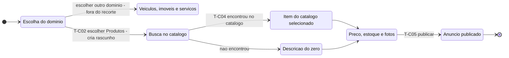

# Engenharia Reversa

Este documento é a entrega conjunta da Subequipe 01. Conforme decidido na [reunião de 24/08/2026](/Atas/Subequipe1/ata24_08.md), o levantamento foi dividido entre os integrantes e cada um registrou por escrito o que observou na interface; aqui os registros estão consolidados em um único texto, com método comum, numeração unificada e uma leitura final que só aparece quando os recortes são lidos juntos.

| Recorte | Escopo | Levantamento |
| -- | -- | -- |
| **A** | Busca e escolha de produto | Pedro Luciano de Azevedo |
| **B** | Carrinho, endereço de entrega e entrada do checkout | Patrick Anderson Carvalho dos Santos |
| **C** | Publicação de anúncio pelo vendedor | Patrick Anderson Carvalho dos Santos |

Os três recortes se encadeiam: A termina onde B começa, e C mostra o outro lado do mesmo catálogo que A percorre.

---

## 1. Contexto e objeto de estudo

O G1_ProjetoComercioEletronico é um comércio eletrônico com modelo misto B2C/C2C: vendedores independentes anunciam sob um mesmo catálogo e a plataforma intermedeia pagamento e entrega. A engenharia reversa foi aplicada sobre a interface web de um sistema de referência do mesmo domínio, usado apenas como inspiração para identificar público-alvo, funcionalidades e regras. Conforme as Diretrizes da disciplina, a fonte de inspiração não é nomeada.

O ator principal dos recortes A e B é o comprador; o do recorte C é o vendedor.

## 2. Método aplicado

O que foi feito se enquadra no que Chikofsky e Cross (1990) chamam de **recuperação de projeto** (*design recovery*): analisar um sistema para identificar seus componentes e inter-relações e produzir representações em nível mais alto de abstração, combinando a observação do artefato com conhecimento de domínio para reconstruir o que ele não expõe. Sem acesso ao código-fonte, o método é de caixa-preta a partir da interface, próximo ao *GUI ripping* de Memon, Banerjee e Nagarajan (2003): percorrer sistematicamente os estados da interface registrando controles, eventos e transições.

| # | Etapa | O que foi feito |
| -- | -- | -- |
| 1 | Delimitação | Definição do recorte e do ator principal |
| 2 | Percurso exploratório | Execução do fluxo do início ao fim, sem registro, para reconhecer os estados |
| 3 | Inventário de tela | Segundo percurso, registrando por escrito cada elemento visível por estado |
| 4 | Inspeção do DOM | Leitura dos atributos dos campos de formulário: `type`, `maxlength`, `inputmode`, `pattern`, `required`, `aria-label` |
| 5 | Provocação de exceções | Busca sem resultado, filtro que zera a listagem, botão "voltar", campo obrigatório vazio perdendo o foco |
| 6 | Observação da URL | Registro de como o estado e o contexto de retorno viajam entre telas e subdomínios |
| 7 | Inferência | Derivação das transições, das regras de negócio e dos requisitos |

**Ferramentas.** Navegador com Ferramentas de Desenvolvedor, indicadas no próprio material da disciplina, e documento compartilhado para o registro escrito.

A etapa 4 foi acrescentada no meio do trabalho e mudou o resultado. Atributos como `maxlength` e a presença ou ausência de `required` são regras de negócio que estão no artefato e que a inspeção visual não alcança — quatro dos requisitos não satisfeitos listados adiante saíram só dali.

---

## 3. Recorte A — Busca e escolha de produto

Do momento em que o comprador digita um termo até decidir que aquele produto é o que ele quer. É o trecho integralmente observável sem conta autenticada e o de maior densidade de decisões de usabilidade.

### 3.1 Inventário de tela

| Estado | Elementos observados |
| -- | -- |
| **Vitrine / busca** | Campo de busca com foco automático; sugestões que surgem ao digitar, antes de submeter; histórico de buscas recentes |
| **Listagem** | Contador de resultados; facetas de filtro (categoria, preço, condição, frete, localização) com contador por opção; seletor de ordenação (relevância, menor preço, maior preço); breadcrumb; carregamento por rolagem, sem paginação clicável; filtros e página refletidos como parâmetros na URL |
| **Cartão de produto** | Imagem, título, preço e parcelamento, selo de frete, nota, número de avaliações e reputação do vendedor |
| **Ficha do produto** | Carrossel com zoom; preço e parcelamento; campo de CEP que recalcula frete e prazo na própria página; dados e reputação do vendedor; avaliações; perguntas e respostas; bloco de outras ofertas para o mesmo produto |
| **Estado vazio** | Mensagem de "nenhum resultado"; sugestão de termos alternativos; sugestão de remover filtros |
| **Retorno pelo "voltar"** | Filtros preservados, porque vêm da URL; posição de rolagem **não** preservada |

### 3.2 Regras de negócio

| ID | Regra |
| -- | -- |
| RN-A01 | A listagem só é exibida se a consulta retornar ao menos um resultado; caso contrário o sistema apresenta estado vazio com termos alternativos. |
| RN-A02 | A ordenação padrão é por relevância, não por preço. |
| RN-A03 | Filtros são cumulativos e cada faceta exibe antecipadamente quantos resultados restarão. |
| RN-A04 | Frete e prazo dependem do CEP e são calculados na ficha do produto, antes do carrinho. |
| RN-A05 | Todo produto de marketplace exibe a reputação do vendedor junto ao preço, já na listagem. |
| RN-A06 | O estado da consulta (termo, filtros, ordenação, página) viaja na URL, o que torna a busca compartilhável e reproduzível. |

### 3.3 Requisitos derivados

| ID | Requisito | Tipo |
| -- | -- | -- |
| RF-A01 | Sugerir termos enquanto o comprador digita, antes da submissão. | Funcional |
| RF-A02 | Filtrar a listagem por facetas cumulativas, exibindo a contagem prévia. | Funcional |
| RF-A03 | Reordenar a listagem por relevância e por preço. | Funcional |
| RF-A04 | Calcular frete e prazo por CEP na ficha do produto. | Funcional |
| RF-A05 | Apresentar nota, número de avaliações e reputação do vendedor por oferta. | Funcional |
| RF-A06 | Oferecer termos alternativos em consulta sem resultados. | Funcional |
| RNF-A01 | Alcançar a ficha do produto em poucos passos a partir da busca. | Eficiência de uso |
| RNF-A02 | Preservar filtros **e posição** ao retornar à listagem. | Reversibilidade |
| RNF-A03 | Produzir feedback imediato na listagem ao aplicar uma faceta. | Feedback imediato |

> **RNF-A02 não é satisfeito.** O achado veio da etapa de provocação de exceções: o botão "voltar" preserva os filtros, que estão na URL, mas reinicia a rolagem.

---

## 4. Recorte B — Carrinho, endereço e entrada do checkout

Começa onde o recorte A termina, no ponto em que o comprador passa a **entregar dados** ao sistema. É onde estão as máscaras, a obrigatoriedade e as mensagens de erro que o material da disciplina pede para inferir — o recorte A quase não tem entrada de dados.

**Limite de escopo.** O percurso foi interrompido antes da tela de pagamento: avançar exigiria confirmar uma compra real, com cobrança real. Tudo que se refere ao pagamento está marcado como inferido.

### 4.1 Inventário de tela

| Estado | Elementos observados |
| -- | -- |
| **Ficha do produto** | Seletor de quantidade exibindo o estoque restante no próprio rótulo ("1 unidade, +50 disponíveis"); dois botões primários lado a lado, "Comprar agora" e "Adicionar ao carrinho"; identificação do vendedor com link para a loja oficial; bloco de outras ofertas para o mesmo produto; no cabeçalho, o controle "Enviar para \<endereço\>" ocupando o lugar do campo de CEP |
| **Carrinho** | Itens agrupados por vendedor, cada grupo com o rótulo "Produtos de \<vendedor\>"; seleção "Todos os produtos" e por item; variação exibida no item; painel "Resumo da compra"; selo "Frete com desconto"; botão "Continuar" com a contagem de itens; ação secundária "Compartilhar carrinho" |
| **Hub de endereços** | Lista de endereços cadastrados com seleção; botão "Adicionar novo endereço"; botão "Confirmar" |
| **Formulário de endereço** | CEP, Rua/Avenida, Número, Complemento, informação adicional, Nome completo, Telefone de contato |
| **Checkout / pagamento** | Não observado |

### 4.2 Transições de estado

No formato padronizado do material da disciplina — *o usuário faz X, e o software exibe Y*:

| ID | Evento | Resposta do software | Status |
| -- | -- | -- | -- |
| T-B01 | Clica em **"Adicionar ao carrinho"** | Incrementa o contador do carrinho no cabeçalho e mantém o usuário na ficha | Observado |
| T-B02 | Clica no **ícone do carrinho** | Navega para `/gz/cart` e exibe os itens agrupados por vendedor | Observado |
| T-B03 | Clica em **"Enviar para \<endereço\>"** a partir do carrinho | **Navega para outra tela** — um hub de endereços — e não abre janela sobreposta; a URL de destino carrega o endereço de retorno e o contexto de origem (`context=cart`) | Observado |
| T-B04 | Clica em **"Adicionar novo endereço"** | Navega para o formulário, **em outro subdomínio**, levando na URL o endereço de retorno | Observado |
| T-B05 | Dá e retira o foco de um campo obrigatório **vazio** | **Não exibe mensagem alguma** — a validação não ocorre na perda de foco | Observado |
| T-B06 | Clica em **"Confirmar"** no hub | Retorna ao carrinho seguindo o endereço de retorno da URL | Inferido de T-B03 |
| T-B07 | Clica em **"Continuar"** no carrinho | Leva à sequência de checkout | Inferido |
| T-B08 | Clica em **"Comprar agora"** na ficha | Leva ao checkout sem passar pelo carrinho | Inferido |

### 4.3 Validadores de campo (inspeção do DOM)

Atributos lidos no formulário de endereço:

| Campo | Rótulo acessível | `maxlength` | `inputmode` | `pattern` | `required` |
| -- | -- | -- | -- | -- | -- |
| `zipCode` | CEP | **8** | `numeric` | `[0-9]*` | ausente |
| `streetName` | Rua / Avenida | 120 | — | — | ausente |
| `streetNumber` | Número | **120** | — | — | ausente |
| `apartment` | Complemento (opcional) | 20 | — | — | ausente |
| `additionalInfo` | — (área de texto) | 128 | — | — | ausente |
| `contact` | Nome completo | 120 | — | — | ausente |
| `phone` | Telefone de contato | **120** | — | — | ausente |

Quatro leituras saem daí, e nenhuma é visível a olho nu:

1. **O CEP não usa máscara.** `maxlength="8"` com `pattern="[0-9]*"` e exemplo `05410001` significam oito dígitos sem separador. Como o hífen conta para o limite, quem digitar `05410-001` perde o último dígito. É inferência a partir do atributo, não observação de digitação.
2. **A obrigatoriedade não está no HTML.** Nenhum campo traz `required`. Ela existe, mas só em linguagem natural e por negação: o único campo marcado é o opcional, no rótulo "Complemento (opcional)".
3. **O tratamento de campos numéricos é inconsistente.** O CEP recebe `inputmode="numeric"`; Número e Telefone, que também são numéricos, não. Em celular, um campo abre teclado numérico e os outros dois não.
4. **Os limites de tamanho não descrevem o domínio.** Número e Telefone aceitam 120 caracteres, o mesmo de Rua/Avenida. O limite protege o armazenamento; qualquer restrição de formato vem do script ou do servidor.

### 4.4 Regras de negócio

| ID | Regra | Base |
| -- | -- | -- |
| RN-B01 | O carrinho agrupa os itens **por vendedor**: o pedido é logicamente múltiplo, com um envio por vendedor. | Observado |
| RN-B02 | O endereço de entrega é dado **da conta**, não do pedido: é escolhido em tela própria, fora do carrinho, e vale para a sessão. | Observado |
| RN-B03 | Contexto de origem e destino de retorno viajam **na URL**, inclusive entre subdomínios: o fluxo é retomável. | Observado |
| RN-B04 | O CEP é armazenado como oito dígitos sem separador; formatar é responsabilidade da exibição. | Observado |
| RN-B05 | A obrigatoriedade de campo não é expressa na estrutura do formulário; é comunicada em texto e verificada por script. | Observado |
| RN-B06 | A validação ocorre **na submissão**, não na perda de foco de cada campo. | Observado |
| RN-B07 | O seletor de quantidade é limitado pelo estoque do anúncio, exibido no próprio controle. | Observado |
| RN-B08 | Existem dois caminhos de compra, e o direto não passa pelo carrinho. | Inferido |
| RN-B09 | O mesmo produto pode ter várias ofertas concorrentes; a ficha exibe uma como principal e as demais em bloco separado. | Observado |

### 4.5 Requisitos derivados

| ID | Requisito | Tipo |
| -- | -- | -- |
| RF-B01 | Agrupar os itens do carrinho por vendedor, com o frete de cada grupo separado. | Funcional |
| RF-B02 | Selecionar e desselecionar itens sem removê-los, recalculando o resumo. | Funcional |
| RF-B03 | Cadastrar e escolher endereço sem perder o estado do carrinho. | Funcional |
| RF-B04 | Aceitar CEP em oito dígitos e normalizar a entrada, com ou sem separador. | Funcional |
| RF-B05 | Limitar a quantidade selecionável ao estoque do anúncio. | Funcional |
| RF-B06 | Oferecer compra direta a partir da ficha, sem passar pelo carrinho. | Funcional |
| RNF-B01 | Declarar a obrigatoriedade também de forma programática, e não só no rótulo. | Acessibilidade |
| RNF-B02 | Oferecer teclado numérico em campos numéricos, de forma consistente. | Usabilidade |
| RNF-B03 | Validar cada campo na perda de foco, e não apenas na submissão. | Prevenção de erros |
| RNF-B04 | Não descartar caracteres digitados sem informar o usuário. | Prevenção de erros |
| RNF-B05 | Não trafegar dados pessoais de entrega em parâmetros de URL entre subdomínios. | Confidencialidade |
| RNF-B06 | Preservar o estado do carrinho na ida a telas auxiliares e no retorno. | Robustez |

> **RNF-B01 a RNF-B04 não são satisfeitos.** Todos saem da inspeção do DOM e da provocação de exceção, e nenhum é perceptível no percurso feliz. Três violam heurísticas clássicas: consistência e padrões (RNF-B02) e prevenção de erros (RNF-B03 e RNF-B04), conforme Nielsen (1994).

---

## 5. Recorte C — Publicação de anúncio pelo vendedor

Os recortes A e B olham o sistema pelo lado de quem compra. Este olha pelo lado de quem alimenta o catálogo — e explica coisas que, do lado do comprador, só apareciam como resultado.

### 5.1 Inventário de tela

| Estado | Elementos observados |
| -- | -- |
| **Escolha do que anunciar** | Pergunta única — "o que você vai anunciar?" — com quatro opções: **Produtos, Veículos, Imóveis e Serviços** |
| **Busca no catálogo** | Título "Para anunciar mais rápido, procure seu produto no nosso catálogo"; três modos de busca em botões de rádio: **por palavras-chave, por foto e por código**; campo de texto livre com `maxlength="1000"` e exemplo de preenchimento com marca e modelo |
| **URL do assistente** | Após a escolha do domínio, a URL passa a conter um **identificador de rascunho** do anúncio, no formato `/anuncie/<id>-list_omnichannel-<hash>/category_form` |

### 5.2 Transições de estado

| ID | Evento | Resposta do software | Status |
| -- | -- | -- | -- |
| T-C01 | Acessa a área de venda | Redireciona para o assistente de anúncio e pergunta o tipo do que será anunciado | Observado |
| T-C02 | Escolhe **"Produtos"** | **Cria um rascunho no servidor** e avança para a busca no catálogo; o identificador do rascunho passa a viajar na URL | Observado |
| T-C03 | Escolhe o modo de busca | Alterna o formulário entre palavras-chave, foto e código, sem trocar de tela | Observado |
| T-C04 | Descreve o produto e submete | Sugere itens do catálogo compatíveis | Inferido |
| T-C05 | Publica o anúncio | Vincula a oferta ao item de catálogo e a expõe na ficha do produto | Inferido |

### 5.3 Regras de negócio

| ID | Regra | Base |
| -- | -- | -- |
| RN-C01 | O rascunho do anúncio é criado **antes de qualquer dado do produto** ser informado, assim que o domínio é escolhido. | Observado |
| RN-C02 | O identificador do rascunho viaja na URL, o que torna o assistente retomável — mesma decisão de projeto de RN-B03. | Observado |
| RN-C03 | O domínio do anúncio (produto, veículo, imóvel ou serviço) é escolhido antes de tudo e determina o formulário seguinte. | Observado |
| RN-C04 | A plataforma tenta **vincular a nova oferta a um item já existente no catálogo** antes de permitir uma descrição livre. | Observado |
| RN-C05 | O vínculo com o catálogo pode ser feito por palavras-chave, por foto ou por código do produto. | Observado |
| RN-C06 | Descrever o produto do zero é o caminho de exceção, não o padrão. | Inferido |

### 5.4 Requisitos derivados

| ID | Requisito | Tipo |
| -- | -- | -- |
| RF-C01 | Classificar o anúncio por domínio antes de coletar os dados do produto. | Funcional |
| RF-C02 | Sugerir itens do catálogo a partir de palavras-chave, foto ou código. | Funcional |
| RF-C03 | Permitir descrever o produto do zero quando não houver item de catálogo correspondente. | Funcional |
| RF-C04 | Persistir o rascunho do anúncio e permitir retomá-lo pela URL. | Funcional |
| RNF-C01 | O identificador do rascunho não deve permitir que terceiros acessem anúncios de outro vendedor. | Confidencialidade |
| RNF-C02 | O assistente deve tolerar interrupção e retomada sem perda do que já foi preenchido. | Robustez |

---

## 6. Fluxos de navegação

O material da disciplina encerra o método pedindo diagramas de fluxo de navegação. Os dois abaixo são escritos em Mermaid, versionados como texto neste próprio arquivo.

**Comprador — recortes A e B:**

```mermaid
stateDiagram-v2
    direction LR

    Vitrine: Vitrine e busca
    Sugestoes: Sugestoes ao digitar
    Listagem: Listagem de resultados
    Vazio: Estado vazio
    Ficha: Ficha do produto
    Carrinho: Carrinho agrupado por vendedor
    Hub: Hub de enderecos
    Form: Formulario de endereco
    FormErro: Formulario com erro
    Checkout: Checkout e pagamento

    [*] --> Vitrine
    Vitrine --> Sugestoes: digitar termo
    Sugestoes --> Listagem: submeter
    Vitrine --> Listagem: submeter
    Listagem --> Vazio: filtro zera a listagem
    Vazio --> Listagem: remover filtro
    Listagem --> Ficha: abrir anuncio
    Ficha --> Listagem: voltar - filtros sim, rolagem nao
    Ficha --> Carrinho: T-B01 adicionar ao carrinho
    Ficha --> Checkout: T-B08 comprar agora - nao percorrido
    Carrinho --> Hub: T-B03 enviar para
    Hub --> Form: T-B04 adicionar novo endereco
    Form --> FormErro: T-B05 submeter invalido
    FormErro --> Form: corrigir campo
    Form --> Hub: submeter valido
    Hub --> Carrinho: T-B06 confirmar - retorno pela URL
    Carrinho --> Checkout: T-B07 continuar - nao percorrido
    Checkout --> [*]
```

**Vendedor — recorte C:**

---

## 7. O que só aparece juntando os três recortes

Lidos isoladamente, os recortes descrevem telas. Lidos juntos, dois fios atravessam o sistema inteiro.

**O catálogo é o eixo do produto.** Em C, a plataforma tenta vincular toda oferta nova a um item de catálogo já existente, e oferece três modos de busca para isso (RN-C04, RN-C05). Em A, o resultado desse vínculo aparece do outro lado: a ficha do produto mostra uma oferta principal e um bloco de ofertas concorrentes para o mesmo item (RN-B09). Em B, a consequência chega ao carrinho, que precisa agrupar por vendedor porque o mesmo produto pode vir de vendedores diferentes (RN-B01). O que parecia uma decisão de layout do carrinho é, na verdade, efeito de uma decisão tomada lá no cadastro do anúncio.

**O estado viaja na URL, e isso é uma decisão de projeto, não um acaso.** Aparece nos três recortes: o estado da consulta em A (RN-A06), o contexto de retorno entre subdomínios em B (RN-B03) e o identificador do rascunho em C (RN-C02). O ganho é o mesmo nos três — fluxo compartilhável e retomável. O custo também: qualquer dado colocado ali fica exposto no histórico, em logs e no cabeçalho de referência, o que sustenta RNF-B05 e RNF-C01.
---

## Histórico de Versões

| Versão | Data | Descrição | Autor(es) | Revisor(es) |
| -- | -- | -- | -- | -- |
| 1.1 | 27/08/2026 | Adição dos recortes de carrinho, endereço e entrada de checkout e de publicação de anúncio pelo vendedor: inspeção do DOM, transições de estado, validadores de campo, diagramas de fluxo de navegação, regras de negócio e requisitos derivados | Patrick Anderson | -- |
