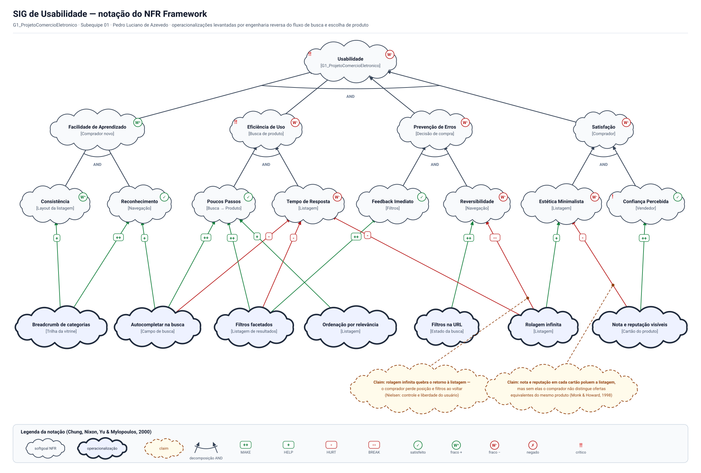

# NFR Framework

Conforme decidido na [reunião de 24/08/2026](/Atas/Subequipe1/ata24_08.md), no SIG cada integrante da Subequipe 01 assume um galho da árvore — um requisito não funcional — para consolidação posterior. Esta página registra o grafo consolidado e a divisão dos galhos.

---

## O que é o artefato

O NFR Framework (CHUNG et al., 2000) trata requisitos não funcionais como *softgoals*: objetivos sem critério de satisfação binário, que não são simplesmente atendidos ou não, mas satisfeitos em grau, dentro de um conjunto de compromissos assumidos. O artefato do framework é o SIG (*Softgoal Interdependency Graph*), um grafo que registra três coisas que uma lista de requisitos não registra:

- **a decomposição** de um softgoal em subgoals, por tipo ou por tópico, com refinamento AND ou OR;
- **as contribuições** das decisões de projeto (as *operacionalizações*) sobre esses softgoals, rotuladas em `++` (MAKE), `+` (HELP), `−` (HURT) e `−−` (BREAK);
- **as correlações**, que são efeitos não intencionais de uma decisão sobre um softgoal que não era o alvo dela.

A avaliação se dá por propagação de rótulos: partindo das operacionalizações escolhidas, os rótulos sobem até a raiz, e o resultado ali é o veredito sobre o quanto aquele conjunto de decisões atende ao requisito. Os *claims*, desenhados em nuvem tracejada, se ligam às **ligações** e não aos nós: registram por que aquela contribuição tem o peso que tem.

---

## O artefato

Clique na imagem para abrir o visualizador em tela cheia, com zoom e arraste.

> _Figura 5 — SIG de Usabilidade do G1\_ProjetoComercioEletronico. Nuvem de borda fina: softgoal NFR. Nuvem azul de borda grossa: operacionalização. Nuvem tracejada âmbar: claim. Aresta verde: contribuição positiva. Aresta vermelha: contribuição negativa. Fonte: Autor, 2026._

### Por que Usabilidade é a raiz do grafo do grupo

O senso crítico do [mapa mental](/Base/Relatórios/SubEquipe01/ArtefatoGeneralista.md) já apontava a lacuna que motivou este artefato: no mapa, "Usabilidade" e "Desempenho" aparecem como nós irmãos, aparentemente independentes, quando na prática filtros facetados com contadores **ajudam** a usabilidade e **prejudicam** o tempo de resposta. Representar esse trade-off exige a notação do NFR Framework.

Usabilidade foi escolhida como raiz única porque é o softgoal que os três recortes de engenharia reversa da subequipe alcançam ao mesmo tempo — busca, checkout e a leitura situacional do Rich Picture — o que permite um grafo só, com galhos que se cruzam, em vez de três grafos isolados que não conversariam na consolidação.

### Como o grafo foi montado

| Passo | O que foi feito |
| -- | -- |
| 1 | Softgoal raiz `Usabilidade [G1_ProjetoComercioEletronico]` |
| 2 | Decomposição AND de 1º nível em quatro softgoals de tipo, atribuídos aos integrantes |
| 3 | Segundo nível, também AND: cada galho refinado em dois softgoals por tópico |
| 4 | Operacionalizações derivadas dos achados registrados na engenharia reversa e no Rich Picture |
| 5 | Correlações negativas: o que cada decisão piora, e não só o que melhora |
| 6 | *Claims* nas duas ligações que precisavam de justificativa |
| 7 | Propagação dos rótulos, do nível das operacionalizações até a raiz |

### Divisão dos galhos

| Galho de 1º nível | Softgoals de 2º nível | Responsável | Base de evidência |
| -- | -- | -- | -- |
| `Facilidade de Aprendizado [Comprador novo]` e `Eficiência de Uso [Busca de produto]` | Consistência, Reconhecimento, Poucos Passos, Tempo de Resposta | Pedro Luciano de Azevedo | [Engenharia reversa do fluxo de busca e escolha de produto](/Base/Relatórios/SubEquipe01/EngenhariaReversa.md) |
| `Prevenção de Erros [Decisão de compra]` | Feedback Imediato, Reversibilidade | Patrick Anderson | Recorte de carrinho, endereço e checkout; [BPMN](/Base/Relatórios/SubEquipe01/BPMN.md) do mesmo fluxo |
| `Satisfação [Comprador]` | Estética Minimalista, Confiança Percebida | Guilherme Costa Zanella | [Rich Picture](/Base/Relatórios/SubEquipe01/ArtefatoGeneralista.md) do fluxo de compra |

As operacionalizações não respeitam essa divisão, e isso é deliberado: `Filtros facetados` contribui para um softgoal do Pedro e um do Patrick; `Rolagem infinita` toca os três galhos. É justamente onde os galhos se cruzam que o grafo diz algo que uma lista de requisitos não diria.

---

## Galho 1 — Facilidade de Aprendizado e Eficiência de Uso

**Responsável:** Pedro Luciano de Azevedo

### Operacionalizações e sua origem

| Operacionalização | Contribui para | Rótulo | Origem |
| -- | -- | -- | -- |
| Breadcrumb de categorias | `Consistência [Layout da listagem]` | `+` | Inventário de tela — breadcrumb observado na listagem |
| Breadcrumb de categorias | `Reconhecimento [Navegação]` | `++` | Mesmo achado: a trilha deixa a posição visível em vez de exigir memória |
| Autocompletar na busca | `Reconhecimento [Navegação]` | `+` | RF-A01 — sugestões surgem ao digitar, antes da submissão |
| Autocompletar na busca | `Poucos Passos [Busca → Produto]` | `++` | RNF-A01 — encurta o caminho até a ficha do produto |
| Filtros facetados | `Poucos Passos [Busca → Produto]` | `++` | RN-A03 e RF-A02 — facetas cumulativas com contagem prévia |
| Ordenação por relevância | `Poucos Passos [Busca → Produto]` | `+` | RN-A02 — a ordenação padrão é por relevância, não por preço |

### Correlações — o que piora

| Operacionalização | Softgoal atingido | Rótulo | Por quê |
| -- | -- | -- | -- |
| Autocompletar na busca | `Tempo de Resposta [Listagem]` | `−` | Sugestão a cada tecla digitada é consulta a cada tecla digitada |
| Filtros facetados | `Tempo de Resposta [Listagem]` | `−` | Cada faceta exibe a contagem de resultados que restará, o que exige contar antes de filtrar |
| Rolagem infinita | `Tempo de Resposta [Listagem]` | `−` | Carregar por rolagem mantém a listagem crescendo na mesma página |

### Propagação neste galho

| Softgoal | Entradas | Rótulo |
| -- | -- | -- |
| `Consistência [Layout da listagem]` | um `+` | **W⁺** |
| `Reconhecimento [Navegação]` | um `++` e um `+` | **✓** |
| `Poucos Passos [Busca → Produto]` | dois `++` e um `+` | **✓** |
| `Tempo de Resposta [Listagem]` | três `−` | **W⁻** |
| `Facilidade de Aprendizado [Comprador novo]` | AND (W⁺, ✓) | **W⁺** |
| **`Eficiência de Uso [Busca de produto]`** | **AND (✓, W⁻)** | **W⁻ — crítico** |

`Eficiência de Uso` é o galho marcado como crítico no grafo, e o motivo é localizável: as três operacionalizações que encurtam o caminho até o produto são exatamente as três que pesam sobre o tempo de resposta. Não há aqui uma decisão errada a corrigir — há um custo que o projeto assume, e o grafo serve para que ele seja assumido explicitamente.

---

## Galho 2 — Prevenção de Erros

**Responsável:** Patrick Anderson

### Operacionalizações e sua origem

| Operacionalização | Contribui para | Rótulo | Origem |
| -- | -- | -- | -- |
| Filtros facetados | `Feedback Imediato [Filtros]` | `++` | RN-A03 e RNF-A03 — a faceta antecipa quantos resultados restarão, antes de ser aplicada |
| Filtros na URL | `Reversibilidade [Navegação]` | `++` | RN-A06 — termo, filtros, ordenação e página viajam na URL, o que torna o estado reproduzível |

### Correlações — o que piora

| Operacionalização | Softgoal atingido | Rótulo | Por quê |
| -- | -- | -- | -- |
| Rolagem infinita | `Reversibilidade [Navegação]` | `−−` | Etapa 4 da engenharia reversa: ao voltar, os filtros são preservados porque vêm da URL, mas a posição de rolagem reinicia do topo |

**Claim C1**, ancorado nessa ligação: *rolagem infinita quebra o retorno à listagem — o comprador perde posição e filtros ao voltar* (NIELSEN, 1994: controle e liberdade do usuário). O claim está no grafo porque o `−−` não é dedução da notação: é a leitura de que perder a posição depois de rolar dezenas de resultados custa mais do que a rolagem economiza.

### Propagação neste galho

| Softgoal | Entradas | Rótulo |
| -- | -- | -- |
| `Feedback Imediato [Filtros]` | um `++` | **✓** |
| `Reversibilidade [Navegação]` | um `++` e um `−−` | **W⁻** |
| **`Prevenção de Erros [Decisão de compra]`** | **AND (✓, W⁻)** | **W⁻** |

`Reversibilidade` é o único softgoal do grafo que recebe uma contribuição forte de cada sinal. O `++` dos filtros na URL e o `−−` da rolagem infinita não se cancelam: eles atuam sobre partes diferentes do mesmo estado — a URL guarda o *filtro*, e nada guarda a *posição*. É por isso que o RNF-A02 aparece na engenharia reversa como requisito que o sistema observado **não** satisfaz.

---

## Galho 3 — Satisfação

*Responsável:* Guilherme Costa Zanella

### Operacionalizações e sua origem

| Operacionalização | Contribui para | Rótulo | Origem |
| -- | -- | -- | -- |
| Rolagem infinita | Estética Minimalista [Listagem] | + | Carregar por rolagem dispensa a paginação clicável, e a listagem fica sem controle de página |
| Nota e reputação visíveis | Confiança Percebida [Vendedor] | ++ | RN-A05 e RF-A05 — todo produto exibe nota, número de avaliações e reputação do vendedor já na listagem |

### Correlações — o que piora

| Operacionalização | Softgoal atingido | Rótulo | Por quê |
| -- | -- | -- | -- |
| Nota e reputação visíveis | Estética Minimalista [Listagem] | − | Cada cartão passa a carregar preço, parcelamento, frete, nota, número de avaliações e reputação |

*Claim C2, ancorado nessa ligação: *nota e reputação em cada cartão poluem a listagem, mas sem elas o comprador não distingue ofertas equivalentes do mesmo produto (MONK; HOWARD, 1998). O claim traduz para a notação a preocupação registrada no Rich Picture — "o produto é confiável?" —, e é o que sustenta aceitar o − sobre a estética em vez de removê-lo.

### Propagação neste galho

| Softgoal | Entradas | Rótulo |
| -- | -- | -- |
| Estética Minimalista [Listagem] | um + e um − | *W⁻* |
| Confiança Percebida [Vendedor] | um ++ | *✓ — crítico* |
| *Satisfação [Comprador]* | *AND (W⁻, ✓)* | *W⁻* |

Confiança Percebida [Vendedor] está marcado como crítico embora esteja satisfeito, e a razão é que ele é o único ponto do grafo em que o vendedor aparece. O Rich Picture registra uma tensão que este SIG não representa: loja oficial e vendedor autônomo competem pela mesma vitrine, e a reputação exibida é parte do que os separa. O softgoal existe aqui do ponto de vista do comprador; do lado do vendedor ele seria outro grafo.

---

## Propagação até a raiz

| Softgoal de 1º nível | Rótulo |
| -- | -- |
| Facilidade de Aprendizado [Comprador novo] | W⁺ |
| Eficiência de Uso [Busca de produto] | W⁻ |
| Prevenção de Erros [Decisão de compra] | W⁻ |
| Satisfação [Comprador] | W⁻ |
| *Usabilidade [G1_ProjetoComercioEletronico]* | *AND (mínimo) → W⁻* |

O grafo não termina em "Usabilidade satisfeita". Termina em *W⁻*, e três dos quatro galhos chegam nesse mesmo rótulo por caminhos distintos. A convergência não é coincidência: Rolagem infinita é a operacionalização que pesa sobre os três — − no tempo de resposta, −− na reversibilidade, e um + na estética que não compensa nenhum dos dois. É a decisão mais cara do grafo, e a que a interface observada adota sem alternativa.

Como a decomposição é AND, adotamos o mínimo entre os filhos: o elo mais fraco define o resultado do pai, e a dívida sobe até a raiz.

---

## Elos com os outros artefatos

| Elemento do SIG | Vem de | Vai para |
| -- | -- | -- |
| Softgoal raiz Usabilidade | Ramo Qualidades (RNF) do [mapa mental](/Base/Relatórios/SubEquipe01/ArtefatoGeneralista.md) | — |
| Poucos Passos, Feedback Imediato, Reversibilidade | RNF-A01, RNF-A03 e RNF-A02 da [engenharia reversa](/Base/Relatórios/SubEquipe01/EngenhariaReversa.md) | — |
| Operacionalizações de busca e listagem | RN-A01 a RN-A06, RF-A01 a RF-A06 | Atividades do [BPMN](/Base/Relatórios/SubEquipe01/BPMN.md) |
| Confiança Percebida [Vendedor] | Concerns e tensão do [Rich Picture](/Base/Relatórios/SubEquipe01/ArtefatoGeneralista.md) | Ponto em aberto: o grafo do lado do vendedor |
| Correlação − em Tempo de Resposta | Trade-off apontado no senso crítico do mapa mental | — |

---

## Limites do grafo

- *A primeira versão não tinha nenhuma aresta vermelha.* Ela listava só o que cada decisão melhora, e nesse formato o SIG não informa nada que uma tabela de requisitos já não informe. Ele só passou a ter função quando perguntamos o que piora — e aí apareceram Tempo de Resposta e Estética Minimalista em W⁻ e Reversibilidade recebendo um −−.
- *A regra do elo mais fraco no AND é uma convenção.* Adotamos o mínimo entre os filhos por ser a leitura mais conservadora. Um avaliador poderia argumentar que os quatro galhos não têm o mesmo peso para o comprador e que o grafo deveria priorizar. O framework permite; não usamos, e o efeito é tratar os quatro como igualmente críticos.
- *O grafo é do ponto de vista do comprador.* O vendedor aparece uma única vez, como tópico de Confiança Percebida. A tensão entre loja oficial e vendedor autônomo, registrada no Rich Picture, não tem representação aqui — ela exigiria um softgoal de imparcialidade do ranking, para o qual não há operacionalização derivável do que foi observado.
- *Consistência tem uma única contribuição fraca.* É o softgoal mais mal sustentado do grafo: só o breadcrumb chega até ele, com +. Não é que o sistema seja inconsistente — é que consistência de layout não é observável em um percurso único, e o rótulo W⁺ reflete a limitação do método, não a qualidade da interface.
- *Disponibilidade e segurança ficaram fora.* Nenhuma das duas é observável por inspeção de interface sem conta autenticada e sem realizar compra. Incluí-las sem operacionalização as deixaria indecisas e, pela regra do AND, arrastaria a raiz inteira para indeciso — o que diria menos, e não mais.

---

## Referências

CHUNG, Lawrence; NIXON, Brian A.; YU, Eric; MYLOPOULOS, John. **Non-Functional Requirements in Software Engineering**. Boston: Kluwer Academic Publishers, 2000.

MONK, Andrew; HOWARD, Steve. The Rich Picture: A Tool for Reasoning About Work Context. **Interactions**, v. 5, n. 2, p. 21–30, mar./abr. 1998.

MYLOPOULOS, John; CHUNG, Lawrence; NIXON, Brian. Representing and using nonfunctional requirements: a process-oriented approach. **IEEE Transactions on Software Engineering**, v. 18, n. 6, p. 483–497, jun. 1992.

NIELSEN, Jakob. Enhancing the explanatory power of usability heuristics. In: **Proceedings of the SIGCHI Conference on Human Factors in Computing Systems (CHI '94)**. Boston: ACM, 1994. p. 152–158.

---

## Histórico de Versões

| Versão | Data | Descrição | Autor(es) | Revisor(es) |
| -- | -- | -- | -- | -- |
| 1.0 | 24/08/2026 | Estruturação inicial | José Joaquim da Silva Neto | Pedro Henrique Gomes |
| 1.1 | 27/08/2026 | Adição da parte geral sobre o SIG | Patrick Anderson, Pedro Luciano de Azevedo, Guilherme Costa Zanella | -- |
| 1.2 | 27/08/2026 | Consolidação em um único SIG, o de Usabilidade, com os quatro galhos de 1º nível divididos entre os três integrantes; operacionalizações, correlações, claims e propagação até a raiz | Pedro Luciano de Azevedo | -- |
| 1.3 | 27/08/2026 | Adição do Galho 3 — Satisfação (operacionalizações, correlações, claim e propagação) e dos elos com os outros artefatos | Guilherme Costa Zanella | -- |
| 1.4 | 27/08/2026 | Adição do Galho 2 — Prevenção de Erros (operacionalizações, correlação, claim e propagação) | Patrick Anderson | -- |
