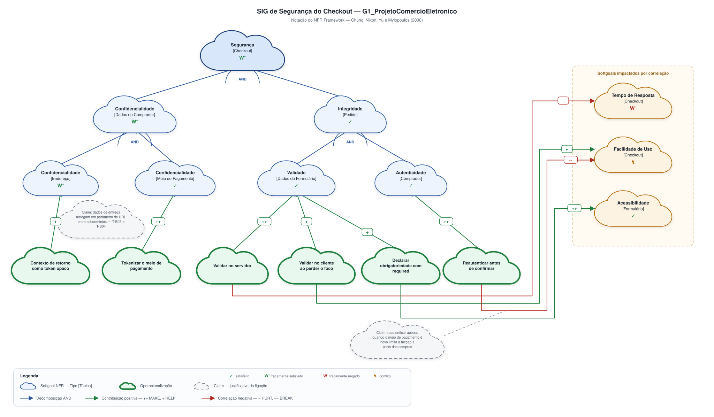

# NFR Framework

Conforme decidido na [reunião de 24/08/2026](/Atas/Subequipe1/ata24_08.md), no SIG cada integrante da Subequipe 01 assume **um galho da árvore** — isto é, um requisito não funcional — para posterior consolidação. Esta página reúne os galhos individuais.

---

## SIG de Segurança do Checkout — Patrick Anderson Carvalho dos Santos

### O que é o artefato

O **NFR Framework** (CHUNG et al., 2000) trata requisitos não funcionais como *softgoals*: objetivos sem critério de satisfação binário, que não são "atendidos" ou "não atendidos", mas **satisficed** em grau — suficientemente satisfeitos dentro de um conjunto de compromissos assumidos. O artefato produzido pelo framework é o **SIG** (*Softgoal Interdependency Graph*), um grafo que registra três coisas que uma lista de requisitos não consegue registrar:

1. **A decomposição** de um softgoal em subgoals, por tipo ou por tópico, com refinamento AND ou OR;
2. **As contribuições** das decisões de projeto (*operacionalizações*) sobre esses softgoals, rotuladas em `++` (MAKE), `+` (HELP), `−` (HURT), `−−` (BREAK); e
3. **As correlações**, que são contribuições **não intencionais** — o efeito colateral de uma decisão sobre um softgoal que não era o alvo dela.

A avaliação do grafo se dá por **propagação de rótulos**: partindo das operacionalizações escolhidas, os rótulos sobem pelo grafo até a raiz, e o resultado na raiz é o veredito honesto sobre o quanto aquele conjunto de decisões atende ao requisito. Os *claims* — softgoals de justificativa, desenhados em nuvem tracejada — se ligam às **ligações**, e não aos nós: eles registram por que aquela contribuição tem o peso que tem.

### O artefato

[](../../../assets/SubEquipe01/SIG_Seguranca_Patrick.svg ":ignore")

<sub>_Clique no diagrama para abri-lo em tamanho real._</sub>

> _Figura 5 — SIG de Segurança do checkout do G1_ProjetoComercioEletronico. Nuvem de borda fina: softgoal NFR. Nuvem de borda grossa: operacionalização. Nuvem tracejada: claim. Aresta preta: contribuição ou decomposição AND. Aresta vermelha: correlação negativa. Fonte: Autor, 2026._

O diagrama é um **SVG gerado por script**: o código-fonte está em [`sig_seguranca_patrick.py`](https://github.com/UnBArqDsw2026-2-Turma01/2026.2-T01-_G1_ProjetoComercioEletronico_Entrega_01/blob/main/docs/assets/SubEquipe01/src/sig_seguranca_patrick.py), e o grafo — nós, ligações, rótulos de contribuição e rótulos de avaliação — está declarado em estruturas de dados no topo do arquivo. Reproduzir ou alterar o SIG é editar uma lista e rodar:

```bash
python3 docs/assets/SubEquipe01/src/sig_seguranca_patrick.py
```

A razão é a mesma do meu [Mapa Mental](/Base/Relatórios/SubEquipe01/ArtefatoGeneralista.md): mudar uma contribuição de `+` para `−−` aparece como uma linha alterada no *diff* do commit, e não como um binário substituído.

### Por que assumi o galho de Segurança

Na divisão combinada em reunião, o Pedro Luciano sinalizou o galho de **Usabilidade**. Assumi **Segurança** por três razões, e nenhuma delas é "sobrou para mim":

1. **É o galho que a minha engenharia reversa sustenta com evidência.** O meu recorte — carrinho, endereço e entrada de checkout — é exatamente o trecho em que o comprador entrega dado pessoal ao sistema. Cada operacionalização deste SIG tem origem rastreável em um achado registrado na [Engenharia Reversa](/Base/Relatórios/SubEquipe01/EngenhariaReversa.md), e não em conhecimento geral sobre segurança.
2. **É o galho que produz conflito com o do Pedro.** Segurança e Usabilidade são o par clássico de softgoals concorrentes. Como os dois galhos existem na mesma subequipe, o conflito não fica no plano da teoria: `Facilidade de Uso [Checkout]` aparece neste grafo em estado de **conflito**, e é o mesmo softgoal que ancora o galho dele. Quando os galhos forem consolidados, esse é o ponto de costura.
3. **Segurança tem catálogo consolidado.** Chung et al. (2000) tratam explicitamente da decomposição de Segurança em Integridade, Confidencialidade e Disponibilidade, o que dá base de literatura à decomposição de primeiro nível em vez de me obrigar a inventá-la.

### Como o grafo foi construído

| Passo | O que foi feito |
| -- | -- |
| 1 | **Softgoal raiz**: `Segurança [Checkout]` — tipo *Segurança*, tópico *Checkout* |
| 2 | **Decomposição AND** do raiz em `Confidencialidade [Dados do Comprador]` e `Integridade [Pedido]` |
| 3 | **Segundo nível**, também AND: Confidencialidade se decompõe por tópico (`Endereço`, `Meio de Pagamento`); Integridade se decompõe em `Validade [Dados do Formulário]` e `Autenticidade [Comprador]` |
| 4 | **Operacionalizações** derivadas dos achados da engenharia reversa (tabela abaixo) |
| 5 | **Correlações**: efeitos não intencionais das operacionalizações sobre `Tempo de Resposta`, `Facilidade de Uso` e `Acessibilidade` |
| 6 | **Claims** ligados às duas ligações que precisavam de justificativa |
| 7 | **Propagação dos rótulos** das operacionalizações até a raiz |

### Operacionalizações e sua origem

Nenhuma operacionalização foi inventada: cada uma responde a um achado registrado.

| Operacionalização | Contribui para | Rótulo | Origem na Engenharia Reversa |
| -- | -- | -- | -- |
| Manter o contexto de retorno como **token opaco** na URL | `Confidencialidade [Endereço]` | `+` | T03 e T04 — o destino de retorno e o contexto trafegam como parâmetro legível, inclusive entre subdomínios (RNF-P05) |
| **Tokenizar** o meio de pagamento | `Confidencialidade [Meio de Pagamento]` | `++` | Ramo `Pontos de Confiança → No ato de pagar` do Mapa Mental; não observado no percurso, assumido como decisão de projeto |
| **Validar no servidor** | `Validade [Dados do Formulário]` | `++` | RN-P05 — nenhum campo declara `required`; a validação é integralmente delegada a script no cliente |
| **Validar no cliente ao perder o foco** | `Validade [Dados do Formulário]` | `+` | RN-P06 e T05 — a validação só ocorre na submissão; campo vazio que perde o foco não produz mensagem |
| **Reautenticar antes de confirmar** | `Autenticidade [Comprador]` | `++` | Sessão autenticada persistente observada durante todo o percurso, sem nova verificação de identidade até a entrada do checkout |
| **Declarar obrigatoriedade com o atributo `required`** | `Validade [Dados do Formulário]` | `+` | RN-P05 e RNF-P01 — a obrigatoriedade só existe no rótulo textual, por negação ("Complemento (opcional)") |

### Correlações — o que piora

| Operacionalização | Softgoal atingido | Rótulo | Por quê |
| -- | -- | -- | -- |
| Validar no servidor | `Tempo de Resposta [Checkout]` | `−` | Cada validação passa a exigir ida ao servidor, somando latência a um fluxo que hoje responde localmente |
| Validar no cliente ao perder o foco | `Facilidade de Uso [Checkout]` | `+` | Feedback imediato por campo reduz retrabalho — é o lado positivo da mesma decisão |
| Reautenticar antes de confirmar | `Facilidade de Uso [Checkout]` | `−−` | Insere uma etapa de identidade no momento de maior intenção de compra do usuário |
| Declarar obrigatoriedade com `required` | `Acessibilidade [Formulário]` | `++` | A obrigatoriedade passa a ser exposta programaticamente e alcança tecnologia assistiva |

### Propagação dos rótulos

| Softgoal | Contribuições recebidas | Rótulo resultante |
| -- | -- | -- |
| `Confidencialidade [Endereço]` | um `+` | **W⁺** — fracamente satisfeito |
| `Confidencialidade [Meio de Pagamento]` | um `++` | **✓** — satisfeito |
| `Confidencialidade [Dados do Comprador]` | AND (W⁺, ✓) → mínimo | **W⁺** |
| `Validade [Dados do Formulário]` | `++`, `+`, `+` | **✓** |
| `Autenticidade [Comprador]` | um `++` | **✓** |
| `Integridade [Pedido]` | AND (✓, ✓) | **✓** |
| **`Segurança [Checkout]`** | **AND (W⁺, ✓) → mínimo** | **W⁺ — fracamente satisfeito** |
| `Tempo de Resposta [Checkout]` | um `−`, nenhum positivo | **W⁻** — fracamente negado |
| `Facilidade de Uso [Checkout]` | um `+` e um `−−` | **↯ conflito** |
| `Acessibilidade [Formulário]` | um `++` | **✓** |

**Leitura do resultado.** O grafo não termina em "Segurança satisfeita". Termina em **W⁺**, e o motivo é localizável: `Confidencialidade [Endereço]` recebe apenas uma contribuição `+`, porque a única operacionalização que eu consegui derivar de evidência para ela — trocar o parâmetro legível por token opaco — reduz a exposição, mas não a elimina; o dado continua saindo do domínio de origem. Como a decomposição é AND, o elo mais fraco define o resultado do pai, e a dívida sobe até a raiz. Um SIG que terminasse em ✓ aqui estaria escondendo isso.

**O conflito em `Facilidade de Uso`.** Ele recebe `+` de uma decisão e `−−` de outra; a notação não resolve isso sozinha — o framework a marca como conflito e devolve a decisão para quem projeta. A minha decisão, registrada no *claim* C2, é **aceitar o `−−` de forma condicionada**: reautenticar apenas quando o meio de pagamento for novo, e não em toda compra, o que restringe a fricção a um subconjunto das transações. Com essa condição, o resultado assumido para `Facilidade de Uso [Checkout]` passa a **W⁻** — fracamente negado, e não negado. O ponto é que **essa é uma decisão, não um cálculo**, e é por isso que ela precisa aparecer no grafo como *claim*, e não como uma nota de rodapé.

### Rastreabilidade e elos com outros artefatos

| Elemento do SIG | Vem de | Vai para |
| -- | -- | -- |
| Softgoal raiz `Segurança [Checkout]` | Ramo `Qualidades RNF → Segurança` do [Mapa Mental](/Base/Relatórios/SubEquipe01/ArtefatoGeneralista.md) | — |
| Decomposição de 1º nível | Mesmo ramo do Mapa Mental + catálogo de Chung et al. (2000) | — |
| Todas as operacionalizações | Achados RN-P05, RN-P06, RNF-P01, RNF-P05 e transições T03–T05 da [Engenharia Reversa](/Base/Relatórios/SubEquipe01/EngenhariaReversa.md) | — |
| Correlação `−` em Tempo de Resposta | Decisão de validar no servidor | Anotação de texto no [BPMN](/Base/Relatórios/SubEquipe01/BPMN.md) |
| Softgoal `Facilidade de Uso [Checkout]` em conflito | Este grafo | **Ponto de costura com o galho de Usabilidade** da subequipe |
| Claim C1 | Transições T03 e T04 | Justifica a priorização de `Confidencialidade [Endereço]` |

### Senso crítico

- **Deixei Disponibilidade de fora, e isso é uma escolha discutível.** O catálogo clássico decompõe Segurança em Integridade, Confidencialidade **e** Disponibilidade. Não modelei o terceiro porque não consegui derivar dele nenhuma operacionalização a partir do que observei — disponibilidade não é observável por inspeção de interface em uma única sessão. A alternativa seria incluí-lo sem operacionalização, o que o deixaria **indeciso** e, pela regra do AND, arrastaria a raiz inteira para indeciso — um resultado que diria menos, não mais. Registro a omissão aqui em vez de deixá-la implícita no desenho.
- **A operacionalização de tokenização é a mais fraca do grafo.** Ela não vem de observação: o percurso foi interrompido antes do pagamento, então "tokenizar o meio de pagamento" é uma decisão de projeto plausível, não um achado. Ela recebe `++` porque, se implementada, de fato resolve o softgoal — mas o rótulo é sobre a decisão hipotética, não sobre o sistema observado. Marcar isso importa: é a única linha da tabela de operacionalizações cuja coluna de origem não aponta para um achado.
- **A propagação por "elo mais fraco" no AND é uma convenção, não uma verdade.** Adotei a regra de o pai receber o mínimo entre os filhos porque é a leitura mais conservadora e a que expõe dívida. Um avaliador poderia argumentar que Confidencialidade de endereço e de meio de pagamento não têm o mesmo peso — vazar um endereço e vazar um cartão têm consequências muito diferentes — e que o grafo deveria ponderar. O NFR Framework permite essa priorização; eu não a usei, e o efeito é que o grafo trata os dois como igualmente críticos, o que provavelmente subestima o meio de pagamento.
- **A primeira versão deste grafo não tinha nenhuma aresta vermelha, e estava errada.** Ela listava só o que cada decisão melhora. Um SIG assim é uma lista de boas intenções desenhada em nuvem: ele não informa nada que uma tabela de requisitos já não informasse. O grafo só passou a ter função quando eu forcei a pergunta inversa — *o que piora quando isto melhora?* — e apareceram `Tempo de Resposta` em W⁻ e `Facilidade de Uso` em conflito. **O valor do NFR Framework está nas arestas que a gente preferiria não desenhar.**

---

## Referências

CHUNG, Lawrence; NIXON, Brian A.; YU, Eric; MYLOPOULOS, John. **Non-Functional Requirements in Software Engineering**. Boston: Kluwer Academic Publishers, 2000.

CHIKOFSKY, Elliot J.; CROSS II, James H. Reverse engineering and design recovery: a taxonomy. **IEEE Software**, v. 7, n. 1, p. 13–17, jan. 1990.

MYLOPOULOS, John; CHUNG, Lawrence; NIXON, Brian. Representing and using nonfunctional requirements: a process-oriented approach. **IEEE Transactions on Software Engineering**, v. 18, n. 6, p. 483–497, jun. 1992.

NIELSEN, Jakob. Enhancing the explanatory power of usability heuristics. In: **Proceedings of the SIGCHI Conference on Human Factors in Computing Systems (CHI '94)**. Boston: ACM, 1994. p. 152–158.

---

## Histórico de Versões

| Versão | Data | Descrição | Autor(es) | Revisor(es) |
| -- | -- | -- | -- | -- |
| 1.0 | 24/08/2026 | Estruturação inicial | José Joaquim da Silva Neto | Pedro Henrique Gomes |
| 1.1 | 27/08/2026 | Adição do galho de Segurança: SIG do checkout gerado por script, com 6 operacionalizações rastreadas à engenharia reversa, 4 correlações, 2 claims, propagação de rótulos e senso crítico | Patrick Anderson Carvalho dos Santos | -- |
