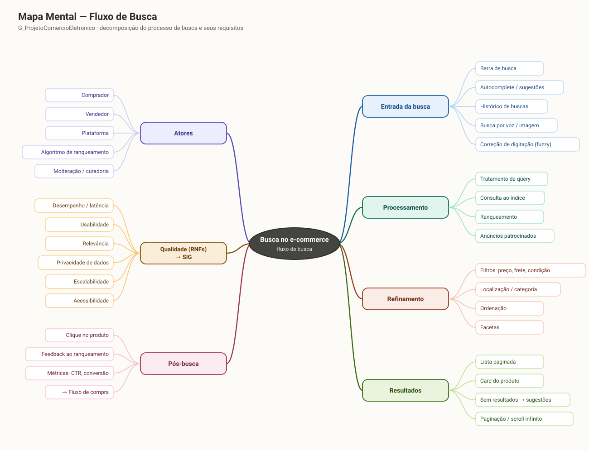

# Artefato Generalista

## Mapa Mental 

### O que é o artefato

O **Mapa Mental** é uma técnica de representação gráfica que parte de um conceito central e o decompõe progressivamente em ramos hierárquicos, usando palavras-chave curtas e cor para apoiar a visão de conjunto (BUZAN; BUZAN, 1993). Diferentemente do BPMN, ele não representa ordem temporal nem decisão: representa **composição** — o que existe dentro do domínio da busca e como cada elemento se agrupa.

### O artefato

> _Figura 1 — Mapa Mental do fluxo de busca no G_ProjetoComercioEletronico. Nó central: o processo de busca. Sete ramos de 1º nível: Atores, Entrada da busca, Processamento, Refinamento, Resultados, Qualidade (RNFs) → SIG e Pós-busca._

O mapa decompõe o fluxo de busca em sete ramos:

- **Atores:** comprador, vendedor, plataforma, algoritmo de ranqueamento, moderação/curadoria.
- **Entrada da busca:** barra de busca, autocomplete/sugestões, histórico de buscas, busca por voz/imagem, correção de digitação (fuzzy).
- **Processamento:** tratamento da query, consulta ao índice, ranqueamento, anúncios patrocinados.
- **Refinamento:** filtros (preço, frete, condição), localização/categoria, ordenação, facetas.
- **Resultados:** lista paginada, card do produto, caso "sem resultados → sugestões", paginação/scroll infinito.
- **Qualidade (RNFs) → SIG:** desempenho/latência, usabilidade, relevância, privacidade de dados, escalabilidade, acessibilidade.
- **Pós-busca:** clique no produto, feedback ao ranqueamento, métricas (CTR, conversão) e transição para o fluxo de compra.

### Por que Mapa Mental (e não Rich Picture)

Escolhi o Mapa Mental porque o objetivo aqui não era retratar uma cena com conflitos entre atores — isso as Subequipes 01 e 03 já cobriram com seus Rich Pictures — mas sim **inventariar de forma estruturada** tudo o que compõe o processo de busca, do clique na barra até a transição para o fluxo de compra. A hierarquia em ramos permite cobrir, num único diagrama, tanto os elementos funcionais (entrada, processamento, refinamento, resultados) quanto os atores e os requisitos não funcionais, algo que o Rich Picture, mais narrativo, tende a diluir.

Essa escolha também favorece a **rastreabilidade com os artefatos seguintes** da subequipe: o ramo _Qualidade (RNFs) → SIG_ aponta diretamente para os softgoals modelados no [Relatório do NFR](NFR.md) (Desempenho, Usabilidade, Relevância, Privacidade de dados), e os ramos _Entrada → Processamento → Refinamento → Resultados_ correspondem às atividades e ao desvio de "sem resultados" formalizados no [Relatório de BPMN](BPMN.md).

### Senso crítico sobre o artefato

- **Não expressa conflito nem trade-off.** O mapa coloca "Desempenho/latência" e "Usabilidade" como ramos irmãos, mas não mostra que operacionalizações como o corretor fonético ajudam a usabilidade e prejudicam a latência. Essa tensão só fica explícita no SIG do NFR Framework.
- **Não expressa ordem nem condição.** O mapa lista "Sem resultados → sugestões" como um nó de Resultados, mas não diz sob qual condição esse caminho é seguido em vez do fluxo normal — papel que cabe ao BPMN.
- **A separação em ramos exige decisões de classificação.** "Anúncios patrocinados" foi colocado sob Processamento, e não sob Resultados, porque é ali, na composição do índice de resposta, que a decisão de mesclar anúncios com resultados orgânicos acontece.
- A decomposição também deixou evidentes tensões de negócio que não cabem no próprio mapa, mas que orientaram minha leitura do domínio: relevância orgânica x anúncios patrocinados, latência x precisão dos resultados, personalização x privacidade de dados, e o interesse do comprador por menor preço x margem do vendedor/plataforma no ranqueamento.

---

## Referências

BUZAN, Tony; BUZAN, Barry. **The Mind Map Book**. London: BBC Books, 1993.

---

## Histórico de Versões

| Versão | Data | Descrição | Autor(es) | Revisor(es) |
| -- | -- | -- | -- | -- |
| 1.0 | 24/08/2026 | Estruturação inicial | José Joaquim da Silva Neto | Pedro Henrique Gomes |
| 1.1 | 27/08/2026 | Adição do Mapa Mental do fluxo de busca, justificativa da escolha e senso crítico | Guilherme Davila, Julia Oliveira Patricio, Maria Clara Sena | -- |
