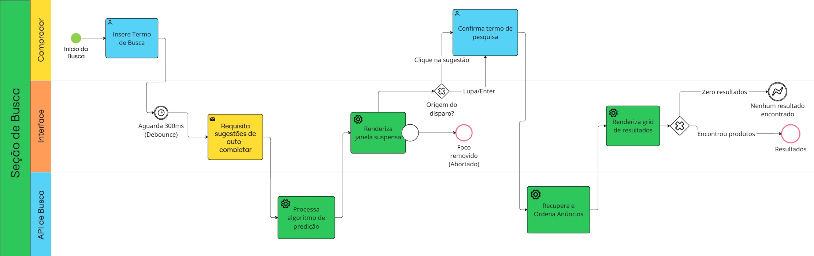

# Engenharia Reversa e BPMN — Seção de Busca

Esta página documenta o processo de engenharia reversa aplicado ao fluxo de busca de um processo de comércio eletrônico. O objetivo deste levantamento é estruturar os achados visuais e de interação para fundamentar o modelo de processos de negócio (BPMN) da Subequipe 02.

---

## 1. Fundamentação Teórica

A engenharia reversa de software é o processo de exame e compreensão de um sistema existente para recapturar ou recriar o seu projeto. Este procedimento decifra os requisitos atualmente implementados, apresentando-os em um nível de abstração mais alto. 

*   A abstração é a habilidade de ignorar aspectos não relevantes para o propósito em questão. 
*   Ao contrário da engenharia progressiva, que parte dos requisitos para o desenvolvimento (do alto para o baixo nível de abstração), a engenharia reversa percorre o caminho inverso.
*   O benefício fundamental desta técnica é o aumento do entendimento do sistema, o que pode facilitar atividades de manutenção, reuso ou novas implementações.

## 2. Inventário de Tela (Interface)

A primeira etapa do processo consistiu no mapeamento dos elementos gráficos visíveis (estado estático) na interface de busca:

*   **Logo:** Botão de retorno à página inicial.
*   **Módulo de Localização:** Indicador textual e interativo exibindo "Enviar para [Cidade] [CEP]" acompanhado de um ícone de pino de mapa.
*   **Barra de Pesquisa (Input Field):** Campo de texto central com o *placeholder* "Buscar produtos, marcas e muito mais...".
*   **Botão de Submissão:** Ícone de lupa localizado à direita, dentro da barra de pesquisa.
*   **Filtro Estrutural (Menu Categorias):** Menu *dropdown* localizado logo abaixo da barra, que permite o afunilamento prévio do escopo da busca.

## 3. Transições de Estados e Comportamento

A partir da interação com os elementos mapeados, foram identificadas as seguintes transições de estado, correlacionando o *Frontend* ao *Backend*:

**I. Comportamento de Auto-complete (Surgimento de janela/menu)**
*   **Ação:** Inserção de um caractere (ex: "m") no campo de input.
*   **Frontend:** O campo transita do estado *Idle* (inativo) para *Active/Focus*. A interface altera dinamicamente o layout, criando uma sobreposição (*overlay*) em formato de lista suspensa.
*   **Backend:** O evento de digitação aciona uma função de *debounce*. O sistema dispara uma requisição GET assíncrona para a API de sugestões. O banco retorna os termos de maior probabilidade de busca (ex: "microondas").

**II. Disparo da Busca (Submissão)**
*   **Ação:** Clique no botão da lupa ou em um dos itens da lista de sugestões.
*   **Frontend:** A interface bloqueia novas entradas (estado *Submitting*). Caso uma sugestão seja clicada, o valor do input é substituído pela string completa antes do disparo.
*   **Backend:** O cliente consolida o pacote de dados (Termo + Variáveis de contexto, como CEP) e envia a requisição principal para o servidor.

**III. Controle de Foco/Blur (Ocultação de menu)**
*   **Ação:** Clique fora da área de busca. Para um mapeamento rigoroso de Interação Humano-Computador (IHC), essas transições representam importantes eventos de cancelamento e rotas de fuga.
*   **Frontend:** Ao ganhar foco, os elementos adjacentes perdem prioridade visual (sobreposição). Ao clicar no fundo da tela, ocorre o evento de perda de foco (*onBlur*), e o menu transita para o estado *Hidden* (oculto).

**IV. Transição para a SERP (Search Engine Results Page)**
*   **Aplicação:** O roteador altera a URL. A interface atual entra em estado de desmontagem (*Unmount*), exibindo transições visuais (*Skeleton* ou *Loaders*). Os dados JSON retornados populam a nova grade de produtos.

## 4. Regras de Negócio Inferidas

A partir das transições, as seguintes regras foram abstraídas:

*   **RN01:** Ao clicar no botão de busca com o campo vazio, o sistema não deve enviar a requisição, mantendo o usuário na interface atual.
*   **RN02:** O sistema deve aplicar sanitização (URL Encoding) em caracteres especiais antes de enviar a requisição.
*   **RN03:** A inserção de um ou mais caracteres alfanuméricos deve acionar a lista suspensa de sugestões preditivas.
*   **RN04:** O sistema deve aguardar um tempo de inatividade pré-configurado (ex: 300ms) após a última tecla antes de disparar a consulta à API.
*   **RN05:** A lista de termos sugeridos deve ser exibida em ordem decrescente de volume histórico/probabilidade de conversão.
*   **RN06:** O campo de CEP deve aceitar exclusivamente caracteres numéricos e aplicar máscara visual (XXXXX-XXX) automaticamente.
*   **RN07:** Um CEP inválido ou incompleto não deve atualizar a localização e deve disparar um alerta de validação em linha.
*   **RN08:** Termos sem correspondência exata, mas com alta similaridade, devem gerar um redirecionamento de busca para o termo corrigido, acompanhado de alerta visual.
*   **RN09:** Buscas sem nenhuma correspondência (mesmo com tolerância ortográfica) devem redirecionar para uma página de resultados vazios com sugestões de reformulação.

## 5. Tradução para BPMN

Os achados da engenharia reversa foram consolidados no diagrama BPMN abaixo, ilustrando o fluxo técnico e as interações do usuário.

*Clique na imagem para abri-la em tamanho real.*

### Mapeamento dos Elementos

*   **Comportamento de Auto-complete:** Modelado com um *Intermediate Message Throw Event* ("Requisitar sugestões de auto-completar"), seguido por *Service Tasks* para o backend ("Processar algoritmo de predição") e frontend ("Renderizar janela suspensa").
*   **Disparo da Busca:** Representado por um *Exclusive Gateway (XOR)* ("Origem do disparo?"), dividindo o fluxo entre o uso do termo exato (Lupa/Enter) ou substituição pelo termo selecionado (Clique na Sugestão).
*   **Controle de Foco/Blur:** Representado por um *Event-Based Gateway / Cancel Event* ("Foco removido"), abortando o fluxo de auto-completar e retornando ao estado inicial sem onerar o backend principal.
*   **Transição para a SERP:** Finaliza com *Service Tasks* para recuperar e renderizar a grade de resultados, culminando em *End Events* que diferenciam a exibição de produtos encontrados do estado de zero resultados.

---

## Referências

BRAGA, Rosana T. Vaccare. **Engenharia Reversa e Reengenharia**. SCE 186 – Engenharia de Software.

---

## Histórico de Versões

| Versão | Data | Descrição | Autor(es) | Revisor(es) |
|---|---|---|---|---|
| 1.0 | 27/08/2026 | Criação da página, registro da engenharia reversa e modelagem BPMN | Julia Oliveira Patricio | -- |