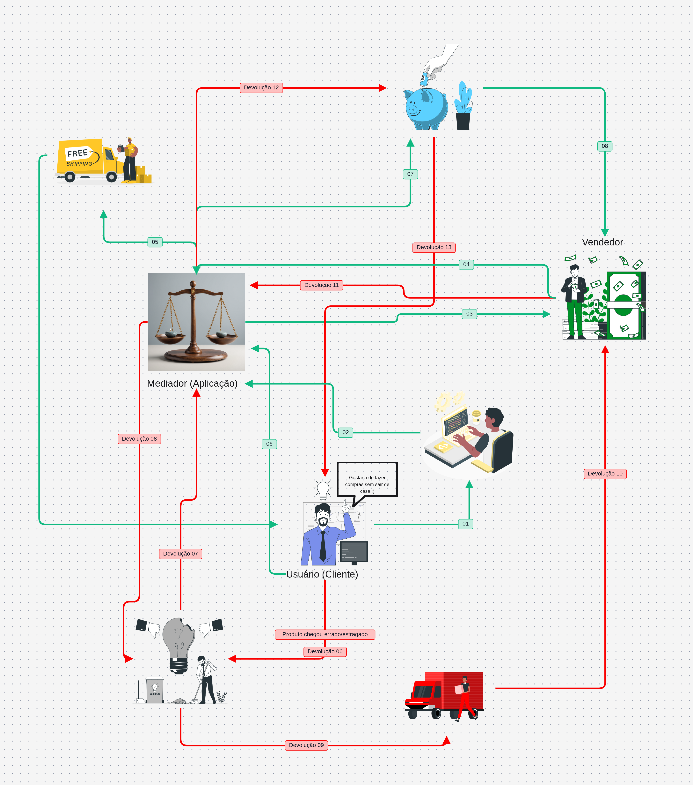

# Artefato Generalista

Conforme discutido na [reunião do dia 24/08/2026](/Atas/Subequipe3/Ata24_08.md), o aluno **José Joaquim da Silva Neto** foi escolhido para estar à frente do desenvolvimento da Rich Picture, guiando sua elaboração e coordenando a construção do artefato em conjunto com os demais integrantes da Subequipe 03. **O desenvolvimento foi realizado de forma colaborativa, com a participação do grupo na construção e no refinamento da representação.**

---

# Rich Picture

> *Figura 1 — Rich Picture do processo de compra, pagamento e devolução no Mercado Livre. Atores: Usuário, Vendedor, Instituição Financeira, transportadoras e o Mediador (Aplicação), representado pela balança. Setas verdes indicam o fluxo de compra e pagamento; setas vermelhas indicam o fluxo de devolução, acionado quando "o produto chega errado/estragado". O ícone de polegares para baixo simboliza a insatisfação do cliente nesse processo.*

---

# Escolha do Artefato 
A escolha do Rich Picture como técnica de elicitação se justifica pela natureza do problema investigado, que envolve múltiplos atores (compradores, vendedores, transportadoras, Mercado Livre como plataforma, sistemas de pagamento) e relações complexas e nem sempre formalizadas entre eles. Diferente de técnicas mais estruturadas como BPMN ou casos de uso, que exigem que o processo já esteja razoavelmente bem delimitado, o Rich Picture permite capturar a situação-problema de forma holística antes de qualquer formalização, incluindo aspectos subjetivos como conflitos de interesse, preocupações informais e percepções dos stakeholders que dificilmente apareceriam em um diagrama de processos.

---

# Embasamento Teórico
A rich picture elaborada para representar a perspectiva do comprador no Comércio Eletrônico segue a técnica descrita por Monk e Howard (1998), que tem origem na Soft Systems Methodology (SSM), desenvolvida por Peter Checkland em Lancaster entre as décadas de 1960 e 1970. A SSM, por sua vez, deriva das abordagens sociotécnicas de design de sistemas, cujo objetivo central é compreender sistemas de atividade humana de forma significativa para os próprios atores envolvidos, e não apenas sob a ótica do analista ou desenvolvedor.
A escolha dessa técnica se justifica pelo problema que os autores apontam logo no início do artigo: sistemas construídos a partir de requisitos tecnicamente bem especificados frequentemente fracassam porque o modelo de trabalho embutido no sistema acaba interferindo em outras tarefas que o usuário também precisa realizar. No caso do Comércio Eletrônico, entender o comprador exige ir além do fluxo transacional de compra, é preciso capturar suas preocupações paralelas (confiança no vendedor, prazo de entrega, garantia, avaliação de terceiros) que não aparecem em um simples fluxograma de checkout.

---

## Referência
MONK, Andrew; HOWARD, Steve. The Rich Picture: A Tool for Reasoning About Work Context. Interactions, v. 5, n. 2, p. 21–30, mar./abr. 1998.

---

## Histórico de Versões

| Versão | Data | Descrição | Autor(es) | Revisor(es) |
| -- | -- | -- | -- | -- |
| 1.0 | 24/08/2026 | Estruturação inicial | José Joaquim da Silva Neto | Pedro Henrique Gomes |
| 1.1 | 25/08/2026 | Adição da Rich Picture e do embasamento| José Joaquim da Silva Neto, João Paulo Barbosa Pereira Nunes, Júlia Santana Campos e Pedro Henrique Gomes | José Joaquim da Silva Neto, João Paulo Barbosa Pereira Nunes, Júlia Santana Campos e Pedro Henrique Gomes |
| 1.2 | 26/08/2026 | Adição de justificativas| José Joaquim da Silva Neto, João Paulo Barbosa Pereira Nunes, Júlia Santana Campos e Pedro Henrique Gomes | José Joaquim da Silva Neto, João Paulo Barbosa Pereira Nunes, Júlia Santana Campos e Pedro Henrique Gomes |
| 1.3 | 27/08/2026 | Adição de justificativas| José Joaquim da Silva Neto, João Paulo Barbosa Pereira Nunes, Júlia Santana Campos e Pedro Henrique Gomes | José Joaquim da Silva Neto, João Paulo Barbosa Pereira Nunes, Júlia Santana Campos e Pedro Henrique Gomes |