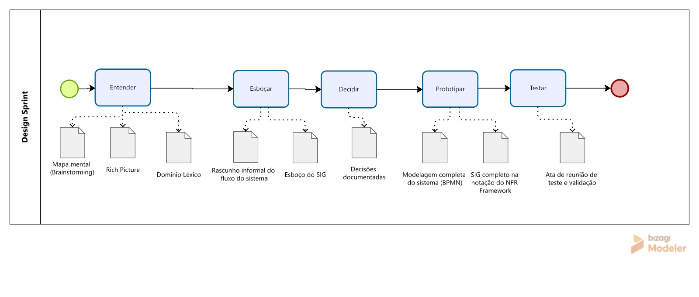
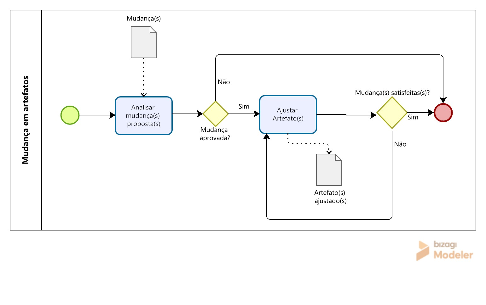

# Design Sprint

A metodologia escolhida pela subequipe 3 foi o Design Sprint, desenvolvida pela Google Ventures, por sua estrutura clara em fases sequenciais (Entender, Esboçar, Decidir, Prototipar e Testar), que se mostrou adequada para organizar tanto o levantamento do domínio do problema quanto a construção dos artefatos formais exigidos nos Focos 1 e 2 do relatório. A metodologia permitiu à equipe percorrer, de forma estruturada, o caminho entre o entendimento informal do e-commerce do Mercado Livre,representado no Rich Picture, até a formalização de dois artefatos distintos: o SIG na notação do NFR Framework e o modelo BPMN do fluxo levantado pela Engenharia Reversa.

---

## Modelagem BPMN da metodologia

### Fases da metodologia Design Sprint

  
   
  <em>Figura 2 — Modelagem BPMN do Design Sprint.</em>
   
  <small>Autor: José Joaquim da Silva Neto.</small>

### Processo de mudança nos artefatos

  
   
  <em>Figura 1 — Modelagem BPMN do processo de mudança nos artefatos.</em>
   
  <small>Autor: José Joaquim da Silva Neto.</small>

---

## Fases da metodologia e elos de rastreabilidade 

### Fase Entender - 24/08/26

Na fase de Entender foi desenvolvido um mapa mental de brainstorming como artefato utilizado para organizar e relacionar as informações, problemas, ideias e percepções levantadas durante a fase Entender. Essa mapa mental concentra todas as ideias e entendimentos dos participantes da subequipe3. Nessa fase também foi desenvolvida a [Rich Picture](/Base/Relatórios/SubEquipe03/ArtefatoGeneralista.md) e definido o [Domínio Léxico](/Base/Relatórios/SubEquipe03/Lexico.md).

#### Brainstorming
<iframe
  width="100%"
  height="600"
  src="https://miro.com/app/board/uXjVHu_ia4s=/"
  frameborder="0"
  scrolling="no"
  allowfullscreen>
</iframe>

### Fase Esboçar - 25/08/26

Na fase de Esboçar, a subequipe produziu um rascunho informal do fluxo do sistema levantado por meio da Engenharia Reversa aplicada sobre o Mercado Livre, capturando a sequência de passos observada antes de comprometer o modelo à notação formal do BPMN. Paralelamente, foi elaborado um esboço do SIG, relacionando os possíveis critérios de qualidade candidatos à formalização no NFR Framework.

### Fase Decidir - 25/08/26

Na fase de Decidir, a subequipe definiu qual fluxo específico do Mercado Livre seria modelado em BPMN e qual critério de qualidade seria formalizado no SIG do NFR Framework, registrando a justificativa de cada escolha com base no que foi levantado nas fases anteriores.

| Decisões |
|   --     |
| Fluxo decidido: login e cadastro  |
| -- |
| -- |
| -- |

### Fase Prototipar - 26/08/26

Na fase de Prototipar, foram construídos os artefatos formais dos dois focos do trabalho: a [modelagem completa do sistema na notação BPMN](/Base/Relatórios/SubEquipe03/BPMN.md), representando o fluxo do Mercado Livre levantado pela Engenharia Reversa, e o [SIG completo na notação do NFR Framework](/Base/Relatórios/SubEquipe03/NFR.md).

### Fase Testar - 27/08/26 e 28/08/26

Na fase de testar a equipe realizou uma reunião com foco em testar e validar todo o trabalho realizado ao longo do processo da metodologia. [reunião do dia 27/08/2026](/Atas/Subequipe3/Ata27_08.md).

Também nessa fase a equipe sentiu a necessidade de realizar uma nova reunião com o intuito de validar novamente todo o trabalho realizado.

[Gravação da Reunião do dia 28/08/26]() [Ata da Reunião do dia 28/08/26]()

---

## Histórico de Versões

| Versão | Data | Descrição | Autor(es) | Revisor(es) |
| -- | -- | -- | -- | -- |
| 1.0 | 25/08/2026 | Estruturação inicial | José Joaquim da Silva Neto | Pedro Henrique Gomes |
| 1.1 | 27/08/2026 | Adição da metodologia e rastreabilidade | José Joaquim da Silva Neto | João Paulo Barbosa Pereira Nunes, Júlia Santana Campos e Pedro Henrique Gomes |
| 1.2 | 28/08/2026 | Adição de legenda nas imagens | José Joaquim da Silva Neto | Pedro Henrique Gomes |
| 1.3 | 28/08/2026 | Adição de elos de rastreabilidade | José Joaquim da Silva Neto | Pedro Henrique Gomes |