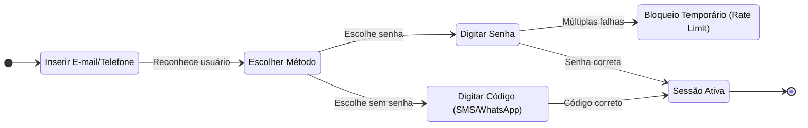

# Engenharia Reversa e Modelagem de Processos

Este documento é a entrega conjunta da subequipe responsável pelos **Subsistemas de Identidade (Cadastro e Login)**. O levantamento consolida a análise de requisitos não funcionais (que originaram os SIGs do NFR Framework) e a modelagem do fluxo de negócio (BPMN). O trabalho integra a observação técnica da interface com a estruturação formal dos processos.

| Frente | Escopo | Foco do Levantamento |
| -- | -- | -- |
| **A** | Cadastro de Usuário | Aquisição, Progressive Profiling e Validação |
| **B** | Login e Gestão de Sessão | Autenticação Passwordless, 2FA e Retenção |
| **C** | Modelagem BPMN | Estruturação lógica e notação de processos |

Os recortes se encadeiam diretamente: as regras de negócio e os trade-offs de usabilidade levantados em A e B formam a base empírica estruturada no processo C.

---

## 1. Contexto e objeto de estudo

O foco deste estudo são os módulos de Autenticação e Gestão de Identidade (IAM) de uma plataforma de comércio eletrônico de referência. O sistema adota padrões modernos para balancear a conversão de novos usuários com a segurança das transações. A engenharia reversa foi aplicada sobre a interface web, analisando os fluxos desde o preenchimento de dados até os bloqueios de segurança.

## 2. Método aplicado

O levantamento combinou **recuperação de projeto** (*design recovery*) em nível de interface (caixa-preta) com o uso de ferramentas de IA para diagnóstico e refinamento de notação.

| # | Etapa | O que foi feito |
| -- | -- | -- |
| 1 | Delimitação | Separação dos domínios em Cadastro (aquisição) e Login (recorrência). |
| 2 | Percurso exploratório | Execução dos fluxos do início ao fim para mapear os caminhos felizes e alternativos (ex: Login via Google vs. E-mail). |
| 3 | Inspeção de Rede/DOM | Análise do momento exato de envio de dados (ex: eventos `input` vs `focus_out`) e verificação de cookies. |
| 4 | Provocação de exceções | Inserção de senhas fracas, tentativas sucessivas de login para forçar rate limiting e testes de e-mails inválidos. |
| 5 | Modelagem Assistida | Estruturação das regras observadas em diagramas BPMN com apoio de IA para diagnóstico estrutural e refinamento visual. |

---

## 3. Recorte A — Cadastro de Usuário

Este recorte analisa o momento em que o usuário anônimo entra na base da plataforma. O foco da arquitetura observada é a redução drástica de fricção inicial (*Lazy Registration*).

### 3.1 Inventário de tela e DOM

| Estado | Elementos observados |
| -- | -- |
| **Seleção de Método** | Botões proeminentes para "Criar conta com Google/Apple" (OAuth); botão secundário para cadastro manual por e-mail. |
| **Formulário de Cadastro** | Campos divididos em múltiplas etapas (Wizard); ausência do campo de CPF/CNPJ no fluxo inicial. |
| **Validação de Senha** | Medidor de força de senha que atualiza dinamicamente a cada tecla digitada (evento `input`); sem necessidade de clicar em "avançar" para obter feedback. |

### 3.2 Regras de negócio derivadas

| ID | Regra | Base |
| -- | -- | -- |
| RN-A01 | **Progressive Profiling:** O CPF não é exigido na criação da conta básica, sendo postergado apenas para o momento de venda ou compra financeira. | Observado |
| RN-A02 | A validação de critérios de segurança de senha ocorre de forma síncrona no client-side a cada caractere. | DOM/Rede |
| RN-A03 | Cadastros via OAuth (Google) assumem o e-mail como verificado, pulando a etapa de OTP. | Observado |

---

## 4. Recorte B — Login e Gestão de Sessão

Este recorte analisa como usuários existentes retornam à plataforma. Destaca-se a ausência de formulários tradicionais de "senha obrigatória".

### 4.1 Inventário de tela e DOM

| Estado | Elementos observados |
| -- | -- |
| **Identificação** | Campo único inicial solicitando "E-mail, telefone ou usuário". |
| **Despacho Multicanal** | Opções dinâmicas de verificação: SMS, WhatsApp, E-mail ou Senha. |
| **Bloqueio (Exceção)** | Mensagem genérica de erro ou exigência de CAPTCHA após múltiplas tentativas falhas. |

### 4.2 Regras de negócio derivadas

| ID | Regra | Base |
| -- | -- | -- |
| RN-B01 | **Autenticação Passwordless:** O OTP (SMS/WhatsApp) funciona como método primário de login, sem forçar a troca de senha posterior. | Observado |
| RN-B02 | **Ofuscação de Erros:** O sistema não confirma se um e-mail não cadastrado existe ou não, mascarando a resposta para evitar enumeração. | Provocação |
| RN-B03 | A sessão gerada é altamente persistente (Long-Lived Cookie), priorizando a usabilidade em retornos futuros em detrimento da confidencialidade local. | DOM |

---

## 5. Recorte C — Modelagem do Processo (BPMN)

Para transpor os achados dos Recortes A e B para um formato padronizado de processos de negócio, foi realizado um trabalho de modelagem profunda, apoiado por inteligência artificial, estruturado em três fases fundamentais:

1. **Diagnóstico Estrutural:** A análise inicial identificou que rascunhos prévios reaproveitavam, por engano, templates genéricos de processos de compra (*Order Fulfillment*), sem relação com o fluxo real de identidades. Foram mapeados erros de notação, como gateways mal colocados e ausência de conteúdo nas raias (*lanes*) planejadas.
2. **Engenharia Reversa Comportamental:** Como não existe uma especificação pública detalhada, a lógica do processo foi reconstruída puramente a partir da observação prática (Recortes A e B). Foram modelados os fluxos de verificação de e-mail e celular, autenticação em duas etapas (2FA), bloqueio por tentativas excedidas (*rate limiting*) e recuperação de acesso. 
3. **Construção e Refinamento Visual:** A aplicação estrita da notação BPMN oficial (pools, raias, gateways exclusivos tipo XOR, eventos de início/fim). Após uma primeira versão com excesso de poluição visual, o layout foi reorganizado, reduzindo o cruzamento de conectores e alinhando as etapas em colunas lógicas, inserindo pontos de interface para tornar a leitura clara.

> *Nota metodológica: Todo o processo de decisão sobre quais regras de negócio modelar e como as etapas se encadeiam partiu da análise humana, com a IA atuando estritamente como ferramenta de apoio ao diagnóstico técnico e refinamento da notação visual.*

---

## 6. Fluxos de Navegação (Estados Básicos)

O comportamento mapeado na engenharia reversa e detalhado no BPMN pode ser resumido nos seguintes fluxos de estado macro:

**Fluxo de Autenticação Multicanal (Login):**

## 7. O que só aparece juntando as frentes

Lidos isoladamente, os SIGs mostram decisões arquiteturais isoladas e o BPMN mostra apenas os passos de um processo. Lidos em conjunto, revela-se a verdadeira estratégia do sistema:

**A conversão governa o design:** O modelo de processos (BPMN) demonstra fluxos complexos de verificação em duas etapas (2FA) e bloqueios, mas a análise de interface e rede (SIG) revela que a plataforma faz de tudo para que o usuário não caia nesses fluxos a menos que seja estritamente necessário. O uso massivo de Autenticação Passwordless (ver RN-B01) e Progressive Profiling (RN-A01) comprova que o sistema absorve o risco inicial de fraude para maximizar a entrada de usuários, empurrando as complexidades processuais mapeadas no BPMN para etapas posteriores (checkout).

---

## 8. Rastreabilidade

| Achado | Vai para | Papel |
| :--- | :--- | :--- |
| Avaliação de Rate Limiting e 2FA | BPMN | Define os gateways de decisão e laços de repetição (XOR) |
| Eventos de Input e Validação Contínua | NFR Framework | Origina a operacionalização de 'Facilidade de Aprendizado' no SIG de Cadastro |
| Sessões persistentes e Passwordless | NFR Framework | Origina as operacionalizações de eficiência e disponibilidade no SIG de Login |

---

## 9. Limites do levantamento

* **Motores de Risco Ocultos:** Mecanismos como reCAPTCHA invisível e análises comportamentais antifraude baseadas em IA foram inferidos pelos seus efeitos (bloqueios), pois operam no backend e não são totalmente inspecionáveis via DOM.
* **Limitações de Caixa-Preta:** As atividades mapeadas no BPMN como "Validar no Servidor" representam caixas pretas lógicas; a arquitetura exata de microsserviços por trás dessas validações é uma aproximação baseada em padrões de mercado.

---

## Histórico de Versões

| Versão | Data | Descrição | Autor(es) | Revisor(es) |
| :--- | :--- | :--- | :--- | :--- |
| 1.0 | 27/08/2026 | Estruturação inicial do documento de Engenharia Reversa e integração da modelagem BPMN | Pedro Henrique Gomes| José Joaquim da Silva Neto |