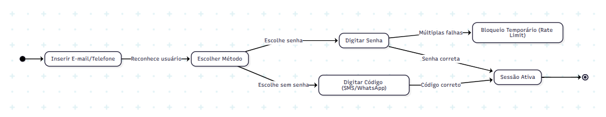

# Engenharia Reversa e Modelagem de Processos

Este documento é a entrega conjunta da subequipe responsável pelos **Subsistemas de Identidade (Cadastro e Login)**. O levantamento consolida a análise de requisitos não funcionais (que originaram os SIGs do NFR Framework) e a modelagem do fluxo de negócio (BPMN). O trabalho integra a observação técnica da interface com a estruturação formal dos processos.

| Frente | Escopo | Foco do Levantamento |
| -- | -- | -- |
| **A** | Cadastro de Usuário | Aquisição, Progressive Profiling e Validação |
| **B** | Login e Gestão de Sessão | Autenticação Passwordless, 2FA e Retenção |
| **C** | Modelagem BPMN | Estruturação lógica e notação de processos |

Os recortes se encadeiam diretamente: as regras de negócio e os trade-offs de usabilidade levantados em A e B formam a base empírica estruturada no processo C.

---

## 1. Contexto e objeto de estudo

O foco deste estudo são os módulos de Autenticação e Gestão de Identidade (IAM) de uma plataforma de comércio eletrônico de referência. O sistema adota padrões modernos para balancear a conversão de novos usuários com a segurança das transações. A engenharia reversa foi aplicada sobre a interface web, analisando os fluxos desde o preenchimento de dados até os bloqueios de segurança.

## 2. Método aplicado

O levantamento combinou **recuperação de projeto** (*design recovery*) em nível de interface (caixa-preta) com o uso de ferramentas de IA para diagnóstico e refinamento de notação.

| # | Etapa | O que foi feito |
| -- | -- | -- |
| 1 | Delimitação | Separação dos domínios em Cadastro (aquisição) e Login (recorrência). |
| 2 | Percurso exploratório | Execução dos fluxos do início ao fim para mapear os caminhos felizes e alternativos (ex: Login via Google vs. E-mail). |
| 3 | Inspeção de Rede/DOM | Análise do momento exato de envio de dados (ex: eventos `input` vs `focus_out`) e verificação de cookies. |
| 4 | Provocação de exceções | Inserção de senhas fracas, tentativas sucessivas de login para forçar rate limiting e testes de e-mails inválidos. |
| 5 | Modelagem Assistida | Estruturação das regras observadas em diagramas BPMN com apoio de IA para diagnóstico estrutural e refinamento visual. |

---

## 3. Recorte A — Cadastro de Usuário

Este recorte analisa o momento em que o usuário anônimo entra na base da plataforma. O foco da arquitetura observada é a redução drástica de fricção inicial (*Lazy Registration*).

### 3.1 Inventário de tela e DOM

| Estado | Elementos observados |
| -- | -- |
| **Seleção de Método** | Botões proeminentes para "Criar conta com Google/Apple" (OAuth); botão secundário para cadastro manual por e-mail. |
| **Formulário de Cadastro** | Campos divididos em múltiplas etapas (Wizard); ausência do campo de CPF/CNPJ no fluxo inicial. |
| **Validação de Senha** | Medidor de força de senha que atualiza dinamicamente a cada tecla digitada (evento `input`); sem necessidade de clicar em "avançar" para obter feedback. |

### 3.2 Regras de negócio derivadas

| ID | Regra | Base |
| -- | -- | -- |
| RN-A01 | **Progressive Profiling:** O CPF não é exigido na criação da conta básica, sendo postergado apenas para o momento de venda ou compra financeira. | Observado |
| RN-A02 | A validação de critérios de segurança de senha ocorre de forma síncrona no client-side a cada caractere. | DOM/Rede |
| RN-A03 | Cadastros via OAuth (Google) assumem o e-mail como verificado, pulando a etapa de OTP. | Observado |

---

## 4. Recorte B — Login e Gestão de Sessão

Este recorte analisa como usuários existentes retornam à plataforma. Destaca-se a ausência de formulários tradicionais de "senha obrigatória".

### 4.1 Inventário de tela e DOM

| Estado | Elementos observados |
| -- | -- |
| **Identificação** | Campo único inicial solicitando "E-mail, telefone ou usuário". |
| **Despacho Multicanal** | Opções dinâmicas de verificação: SMS, WhatsApp, E-mail ou Senha. |
| **Bloqueio (Exceção)** | Mensagem genérica de erro ou exigência de CAPTCHA após múltiplas tentativas falhas. |

### 4.2 Regras de negócio derivadas

| ID | Regra | Base |
| -- | -- | -- |
| RN-B01 | **Autenticação Passwordless:** O OTP (SMS/WhatsApp) funciona como método primário de login, sem forçar a troca de senha posterior. | Observado |
| RN-B02 | **Ofuscação de Erros:** O sistema não confirma se um e-mail não cadastrado existe ou não, mascarando a resposta para evitar enumeração. | Provocação |
| RN-B03 | A sessão gerada é altamente persistente (Long-Lived Cookie), priorizando a usabilidade em retornos futuros em detrimento da confidencialidade local. | DOM |

---

## 5. Recorte C — Modelagem do Processo (BPMN)

Para transpor os achados dos Recortes A e B para um formato padronizado de processos de negócio, foi realizado um trabalho de modelagem profunda, apoiado por inteligência artificial, estruturado em três fases fundamentais:

1. **Diagnóstico Estrutural:** A análise inicial identificou que rascunhos prévios reaproveitavam, por engano, templates genéricos de processos de compra (*Order Fulfillment*), sem relação com o fluxo real de identidades. Foram mapeados erros de notação, como gateways mal colocados e ausência de conteúdo nas raias (*lanes*) planejadas.
2. **Engenharia Reversa Comportamental:** Como não existe uma especificação pública detalhada, a lógica do processo foi reconstruída puramente a partir da observação prática (Recortes A e B). Foram modelados os fluxos de verificação de e-mail e celular, autenticação em duas etapas (2FA), bloqueio por tentativas excedidas (*rate limiting*) e recuperação de acesso. 
3. **Construção e Refinamento Visual:** A aplicação estrita da notação BPMN oficial (pools, raias, gateways exclusivos tipo XOR, eventos de início/fim). Após uma primeira versão com excesso de poluição visual, o layout foi reorganizado, reduzindo o cruzamento de conectores e alinhando as etapas em colunas lógicas, inserindo pontos de interface para tornar a leitura clara.

> *Nota metodológica: Todo o processo de decisão sobre quais regras de negócio modelar e como as etapas se encadeiam partiu da análise humana, com a IA atuando estritamente como ferramenta de apoio ao diagnóstico técnico e refinamento da notação visual.*

---

## 6. Fluxos de Navegação (Estados Básicos)

O comportamento mapeado na engenharia reversa e detalhado no BPMN pode ser resumido nos seguintes fluxos de estado macro:

**Fluxo de Autenticação Multicanal (Login):**

## 7. O que só aparece juntando as frentes

Lidos isoladamente, os SIGs mostram decisões arquiteturais isoladas e o BPMN mostra apenas os passos de um processo. Lidos em conjunto, revela-se a verdadeira estratégia do sistema:

**A conversão governa o design:** O modelo de processos (BPMN) demonstra fluxos complexos de verificação em duas etapas (2FA) e bloqueios, mas a análise de interface e rede (SIG) revela que a plataforma faz de tudo para que o usuário não caia nesses fluxos a menos que seja estritamente necessário. O uso massivo de Autenticação Passwordless (ver RN-B01) e Progressive Profiling (RN-A01) comprova que o sistema absorve o risco inicial de fraude para maximizar a entrada de usuários, empurrando as complexidades processuais mapeadas no BPMN para etapas posteriores (checkout).

---

## 8. Rastreabilidade

| Achado | Vai para | Papel |
| :--- | :--- | :--- |
| Avaliação de Rate Limiting e 2FA | BPMN | Define os gateways de decisão e laços de repetição (XOR) |
| Eventos de Input e Validação Contínua | NFR Framework | Origina a operacionalização de 'Facilidade de Aprendizado' no SIG de Cadastro |
| Sessões persistentes e Passwordless | NFR Framework | Origina as operacionalizações de eficiência e disponibilidade no SIG de Login |

---

## 9. Limites do levantamento

* **Motores de Risco Ocultos:** Mecanismos como reCAPTCHA invisível e análises comportamentais antifraude baseadas em IA foram inferidos pelos seus efeitos (bloqueios), pois operam no backend e não são totalmente inspecionáveis via DOM.
* **Limitações de Caixa-Preta:** As atividades mapeadas no BPMN como "Validar no Servidor" representam caixas pretas lógicas; a arquitetura exata de microsserviços por trás dessas validações é uma aproximação baseada em padrões de mercado.

---

## 10. Requisitos Funcionais (Revisitados)

Esta seção consolida em requisitos funcionais (RF) as funcionalidades observadas — explícita e implicitamente — nos Recortes A, B e C. As declarações seguem a estrutura *"O sistema deve..."* / *"O [ator] deve ser capaz de..."*, com atores identificados e redação testável e independente. As incongruências do texto original que foram corrigidas estão detalhadas ao final.

### 10.1 Atores

| Ator | Descrição |
| :--- | :--- |
| **Usuário Não Autenticado** | Visitante anônimo, sem conta ou sem sessão ativa. |
| **Cliente** | Usuário autenticado que utiliza a plataforma para comprar. |
| **Vendedor** | Usuário autenticado habilitado a anunciar e vender. |
| **Sistema** | Plataforma de IAM e seus serviços de verificação, sessão e antifraude. |

### 10.2 Cadastro e Perfil

| ID | Requisito Funcional | Ator | Base |
| :--- | :--- | :--- | :--- |
| RF01 | O Usuário Não Autenticado deve ser capaz de criar uma conta por meio de provedores de identidade externos (OAuth), no mínimo Google e Apple. | Usuário Não Autenticado | RN-A03 / 3.1 |
| RF02 | O Usuário Não Autenticado deve ser capaz de criar uma conta manualmente informando um endereço de e-mail. | Usuário Não Autenticado | 3.1 |
| RF03 | O sistema deve apresentar o formulário de cadastro manual em múltiplas etapas (wizard), solicitando em cada etapa apenas o subconjunto mínimo de dados necessário para avançar. | Sistema | 3.1 |
| RF04 | O sistema não deve exigir CPF/CNPJ para a criação da conta básica. | Sistema | RN-A01 |
| RF05 | O sistema deve solicitar e validar o CPF/CNPJ apenas quando o Cliente iniciar uma compra com pagamento ou quando o usuário solicitar habilitação como Vendedor (*Progressive Profiling*), bloqueando a conclusão dessas operações até o preenchimento. | Cliente / Vendedor | RN-A01 |
| RF06 | Durante a definição da senha, o sistema deve exibir um medidor de força atualizado dinamicamente a cada caractere digitado (evento `input`), sem exigir a submissão do formulário. | Sistema | RN-A02 / 3.1 |
| RF07 | O sistema deve validar os critérios de segurança da senha no servidor no ato da submissão, recusando o cadastro quando a política mínima não for atendida, independentemente do feedback exibido no cliente. | Sistema | RN-A02 / 5 / 9 |
| RF08 | Para cadastros manuais por e-mail, o sistema deve verificar a titularidade do e-mail por meio de código de uso único (OTP) antes de ativar a conta. | Sistema | RN-A03 (contraposição) |
| RF09 | Para cadastros via OAuth, o sistema deve considerar o e-mail fornecido pelo provedor como verificado e dispensar a etapa de OTP. | Sistema | RN-A03 |

### 10.3 Autenticação e Login

| ID | Requisito Funcional | Ator | Base |
| :--- | :--- | :--- | :--- |
| RF10 | O sistema deve oferecer um campo único de identificação inicial que aceite e-mail, número de telefone ou nome de usuário. | Usuário Não Autenticado | 4.1 |
| RF11 | Após a identificação, o sistema deve apresentar dinamicamente apenas os métodos de verificação habilitados para a conta, dentre: OTP por SMS, OTP por WhatsApp, OTP/link por e-mail e senha. | Sistema | 4.1 / 6 |
| RF12 | O Usuário Não Autenticado deve ser capaz de concluir o login exclusivamente por OTP (*passwordless*), sem que o sistema exija o cadastro ou a redefinição de senha posteriormente. | Usuário Não Autenticado | RN-B01 |
| RF13 | O sistema deve permitir, alternativamente, a autenticação por senha para contas que possuam senha definida. | Usuário Não Autenticado | 4.1 |
| RF14 | Quando a tentativa for classificada como suspeita pelo motor de risco, o sistema deve exigir um segundo fator de autenticação (2FA) adicional ao método primário antes de conceder acesso. | Sistema | 5.2 / 7 / 9 |
| RF15 | O Usuário Não Autenticado deve ser capaz de solicitar o reenvio do código OTP e de alternar o canal de entrega durante o fluxo de verificação. | Usuário Não Autenticado | 5.2 / 6 |

### 10.4 Recuperação de Acesso

| ID | Requisito Funcional | Ator | Base |
| :--- | :--- | :--- | :--- |
| RF16 | O sistema deve disponibilizar um fluxo de recuperação de acesso que permita ao usuário reautenticar-se por canal alternativo previamente verificado (e-mail ou telefone) quando não conseguir usar seu método habitual. | Usuário Não Autenticado | 5.2 |
| RF17 | O sistema deve permitir a redefinição de senha somente após a conclusão da verificação de identidade por OTP. | Usuário Não Autenticado | 5.2 |

### 10.5 Gestão de Sessão

| ID | Requisito Funcional | Ator | Base |
| :--- | :--- | :--- | :--- |
| RF18 | Após a autenticação bem-sucedida, o sistema deve estabelecer uma sessão persistente de longa duração (*long-lived cookie*), dispensando a reautenticação em retornos futuros. | Sistema | RN-B03 |
| RF19 | O Cliente deve ser capaz de encerrar a sessão ativa (*logout*) manualmente. | Cliente | RN-B03 (lacuna) |
| RF20 | O sistema deve exigir reautenticação (*step-up*) para operações sensíveis mesmo com sessão ativa, notadamente na conclusão do checkout e na alteração de dados de segurança da conta. | Sistema | 7 |

### 10.6 Segurança e Antifraude

| ID | Requisito Funcional | Ator | Base |
| :--- | :--- | :--- | :--- |
| RF21 | O sistema deve limitar o número de tentativas consecutivas de autenticação por identificador e por origem (*rate limiting*) dentro de uma janela de tempo definida. | Sistema | RN-B02 / 4.1 / 8 |
| RF22 | Ao exceder o limite de tentativas, o sistema deve bloquear temporariamente novas tentativas e/ou exigir a resolução de um desafio CAPTCHA antes de permitir o prosseguimento. | Sistema | 4.1 / 8 |
| RF23 | O sistema deve retornar mensagens de erro genéricas nas falhas de cadastro e de autenticação, sem revelar se um identificador está ou não cadastrado (prevenção de enumeração de usuários). | Sistema | RN-B02 |
| RF24 | O sistema deve submeter as tentativas de cadastro e de login a um motor de risco/antifraude (incluindo reCAPTCHA invisível), que pode acionar verificação adicional ou bloqueio. | Sistema | 9 |

### 10.7 Incongruências corrigidas em relação ao texto original

1. **Validação de senha só no cliente (RN-A02).** O texto sugeria que a validação de segurança da senha ocorria exclusivamente no *client-side* a cada caractere, o que constitui falha de segurança e contradiz a atividade "Validar no Servidor" citada nas seções 5 e 9. A funcionalidade foi desdobrada em **RF06** (feedback dinâmico no cliente) e **RF07** (validação autoritativa no servidor).
2. **OAuth restrito ao Google (RN-A03).** A regra citava apenas "Google", mas o inventário da seção 3.1 lista "Google/Apple" e o termo genérico OAuth. Generalizado em **RF01** e **RF09**.
3. **Terminologia de OTP inconsistente.** RN-B01 menciona apenas SMS/WhatsApp; a seção 4.1 e o título da seção 6 ("Multicanal") incluem o e-mail; RN-A03 usa "OTP" para e-mail, canal em que normalmente se usa link. Padronizado como "OTP/link por e-mail" e canais explicitados em **RF11**.
4. **2FA sem regra correspondente.** A autenticação em duas etapas aparece nos Recortes C (seção 5.2) e na seção 7, mas nenhuma regra de negócio do Recorte B a descreve. Lacuna preenchida por **RF14**, modelada como verificação condicional baseada em risco — coerente com a estratégia "a conversão governa o design".
5. **Recuperação de acesso sem regra nem tela.** Citada na seção 5.2 como fluxo modelado no BPMN, mas ausente do inventário e das regras. Lacuna preenchida por **RF16** e **RF17**.
6. **Sessão persistente sem encerramento (RN-B03).** O texto descreve o *long-lived cookie*, mas não menciona *logout* nem reautenticação para ações sensíveis. Adicionados **RF19** (encerramento manual) e **RF20** (*step-up* no checkout, apoiado na seção 7).
7. **Progressive Profiling com ator ambíguo (RN-A01).** "Momento de venda ou compra financeira" não distinguia o comprador do vendedor. Explicitado em **RF05** (Cliente em compra com pagamento vs. habilitação como Vendedor).
8. **Rate limiting, bloqueio e ofuscação de erro tratados como efeito único.** A seção 4.1 descrevia "mensagem genérica de erro *ou* CAPTCHA" como um comportamento só. Separados em três requisitos testáveis de forma independente: **RF21** (limite de tentativas), **RF22** (resposta ao bloqueio) e **RF23** (ofuscação/anti-enumeração).

---

## Histórico de Versões

| Versão | Data | Descrição | Autor(es) | Revisor(es) |
| :--- | :--- | :--- | :--- | :--- |
| 1.0 | 27/08/2026 | Estruturação inicial do documento de Engenharia Reversa e integração da modelagem BPMN | Pedro Henrique Gomes| José Joaquim da Silva Neto |
| 1.1 | 28/08/2026 | Atualização do documento de Engenharia Reversa e integração da modelagem BPMN | Júlia Santana Campos, João Paulo Barbosa Pereira Nunes e Pedro Henrique Gomes| José Joaquim da Silva Neto |
| 1.2 | 28/08/2026 | Extração e padronização dos Requisitos Funcionais (seção 10) a partir da engenharia reversa, com correção de incongruências do texto original | Júlia Santana Campos | José Joaquim da Silva Neto |